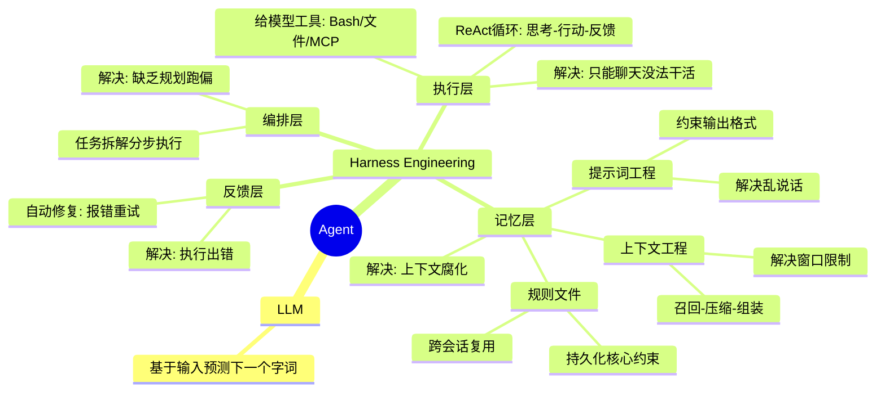

## 概念梳理

---

### LLM
大模型本质就是一个磁盘上的超大参数文件。将它加载到显卡内存里，配上HTTP接口就成了大模型API服务。大模型做的事情也很简单，就是基于当前输入的内容预测下一个字词大概率会是什么，它本质上只是在猜你想要什么。

### Prompt Engineering
如果你给LLM的指令太宽泛，那它预测的答案就会非常发散。比如你问它“做个去云南的攻略”，它可能会给你整出一个长达15天、预算上万的豪华包车游。
但如果你补一句：“你现在是一个穷游达人，背景是我只有周末2天时间；预算不能超过1000块，千万别去人挤人的热门景点，请用表格的形式列出我的行程安排”，它给的结果才会更符合要求，为你量身定制一个特种兵式的周末游。能加的内容有很多，比如角色设定、背景、历史对话、参考文档、限制、输出格式，这些约束构成了所谓的提示词。而这种有意识地调整和设计提示词，让模型稳定地朝着你预期的内容和格式输出的技术手段，就是所谓的提示词工程，它解决的是大模型无引导乱说话的问题。

### Context Engineering
提示词写的越长越仔细，模型知道的就越多，回答就越准，反过来同理。大模型回答不准，那大概率是因为知道的不够多，于是大家很自然会不断往大模型里塞各种资料。这些打包到一起发给大模型的所有信息就叫上下文，提示词只是上下文的一部分。
但大模型再强，一次性能处理的上下文也有最大限制，这个限制叫上下文窗口。在AI大模型应用里多对话几轮，就很容易将上下文窗口打满。于是就需要通过一些策略去压缩或丢弃部分信息，在这个过程中不可避免会丢失关键信息，从而破坏上下文的完整性和准确性。这类问题被统称为上下文腐化，效果上就是模型开始记不住，回答前后不一致。
上下文窗口就这么大，于是问题就变成了怎么才能在合适的时候将合适的内容塞入到有限的上下文中，于是衍生了一套负责动态管理大模型上下文的技术，也就是所谓的上下文工程。提示词是上下文的一部分，那自然提示词工程其实也是上下文工程的一部分，上下文工程可以总结为三个步骤：召回、压缩和组装。第一步召回，说白了就是找什么信息，这些信息可以来自外部知识库，也可以来自过去聊天记录、当前代码环境以及程序运行报错等。总之就是从里面找出最相关的内容。信息很多，上下文窗口有限，所以需要将信息变小，于是引入第二步压缩。比如将信息分开发给大模型做总结。之后就是组装，因为信息放置的位置和顺序会直接影响模型的理解和输出，比如越靠后越容易被模型关注，所以我们需要通过一定的结构重新组装内容，这样进入模型的上下文更精简、更相关，输出也会更稳定、更准确。不同AI工具的上下文工程策略不同，所以你会发现就算用的是同一个模型，不同AI工具的执行效果也会有差异

### Harness Engineering

#### 执行层

提示词工程解决了大模型无引导乱说话的问题，上下文工程解决的是上下文的组织问题。模型是更聪明了，但他只能聊天，没法帮我们干活。于是我们可以给大模型加入 Bash 沙箱、文件系统、MCP 这些能力，让它能像人一样操作外部工具，读写代码文件，执行命令做测试。它们共同构成了执行层。
将上下文工程+大模型+执行层串成一个流程，在外部套一层循环，于是我们就可以通过提示词工程和上下文工程组装上下文发给大模型。大模型负责思考，外部程序负责执行，执行过程中得到的报错等信息，再加到上下文里，继续推理和执行。这套一边思考一边行动的循环就是所谓的 ReAct，而这个能通过聊天帮你执行任务的程序，就是所谓的 AI Agent。Agent 的本质就是一个 for 循环。

#### 记忆层
只要这个循环一长，上下文就一定会膨胀，上下文工程做再好也可能会腐化。随着它看过的文件越来越多，拿到的信息越来越杂，前面定好的目标和约束，后面可能慢慢就被冲淡了，理解也会越来越偏，怎么办呢？很简单，只要我们可以保证每次给大模型的上下文中都包含一些可复用的核心信息，比如项目目标、技术栈、需求背景、代码风格、禁止事项等，只要保证这部分一直在，那大模型就能在大框架约束下减少理解偏移。
这些核心信息可以单独写成规则文件，固定在代码仓库里，比如 Claude Code 用 claude.md，Cursor 用 .cursorrules 文件。规则文件会在调用大模型的时候作为系统提示词，自动注入上下文。规则文件写多了也会变长，所以上下文也会很长，那就把它拆成几份更短的文件，再加一个简单的路由。比如背景就读 bg.md，技术栈就看 stack.md，一般情况下只需要加载文件地址路径，真正需要的时候再加载文件的全部内容。将它们跟提示词工程和上下文工程配合在一起，形成记忆层。

#### 反馈层
有了记忆层和执行层的配合，Agent 就能不停写代码，跑 linter 和单元测试。过程中发现执行有问题，还可以将测试输出和报错加入到上下文里，这样就可以驱动 Agent 在下一轮循环中自动做修复。这套通过检验结果回算错误来实现自动修复问题的能力，形成了反馈层。

#### 编排层
但 Agent的循环如果缺乏全局规划和清晰的结束目标，依然很容易跑偏，甚至陷入无效死循环。所以我们还可以将大任务拆解为有明确执行标准的多个子任务，就像这样按规划驱动Agent分步执行。这种以全局规划为核心，对任务做拆解与全流程管控的能力，形成了编排层。

编排层、执行层、反馈层和记忆层这些能力，共同组成了一套包裹着大模型的工程外壳，它就是Harness Engineering。大模型越强，外壳就可以做得越薄，但无论怎么样这层外壳都得有

### Agent
> https://www.langchain.com/blog/the-anatomy-of-an-agent-harness
> Agent = Model + Harness.  Harness engineering is how we build systems around models to turn them into work engines.  The model contains the intelligence and the harness makes that intelligence useful

所以我们可以认为 Agent 就是 LLM + Harness Engineering. 