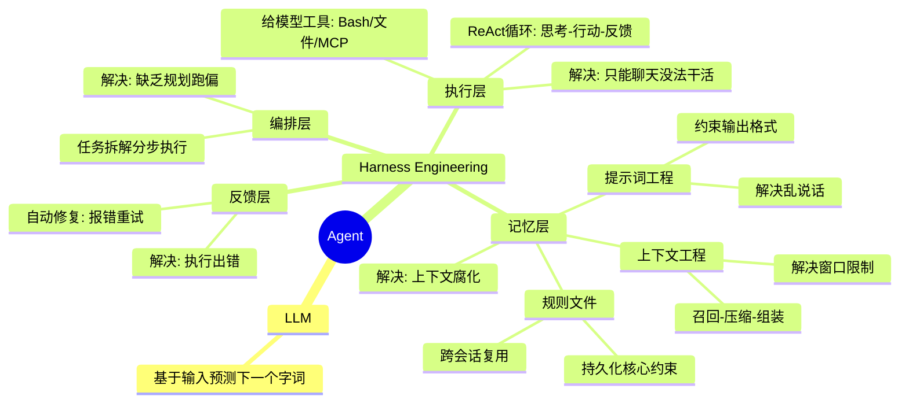

# 学习
## 概念梳理



---

### LLM
大模型本质就是一个磁盘上的超大参数文件。将它加载到显卡内存里，配上HTTP接口就成了大模型API服务。大模型做的事情也很简单，就是基于当前输入的内容预测下一个字词大概率会是什么，它本质上只是在猜你想要什么。

### Prompt Engineering
如果你给LLM的指令太宽泛，那它预测的答案就会非常发散。比如你问它“做个去云南的攻略”，它可能会给你整出一个长达15天、预算上万的豪华包车游。
但如果你补一句：“你现在是一个穷游达人，背景是我只有周末2天时间；预算不能超过1000块，千万别去人挤人的热门景点，请用表格的形式列出我的行程安排”，它给的结果才会更符合要求，为你量身定制一个特种兵式的周末游。能加的内容有很多，比如角色设定、背景、历史对话、参考文档、限制、输出格式，这些约束构成了所谓的提示词。而这种有意识地调整和设计提示词，让模型稳定地朝着你预期的内容和格式输出的技术手段，就是所谓的提示词工程，它解决的是大模型无引导乱说话的问题。

### Context Engineering
提示词写的越长越仔细，模型知道的就越多，回答就越准，反过来同理。大模型回答不准，那大概率是因为知道的不够多，于是大家很自然会不断往大模型里塞各种资料。这些打包到一起发给大模型的所有信息就叫上下文，提示词只是上下文的一部分。
但大模型再强，一次性能处理的上下文也有最大限制，这个限制叫上下文窗口。在AI大模型应用里多对话几轮，就很容易将上下文窗口打满。于是就需要通过一些策略去压缩或丢弃部分信息，在这个过程中不可避免会丢失关键信息，从而破坏上下文的完整性和准确性。这类问题被统称为上下文腐化，效果上就是模型开始记不住，回答前后不一致。
上下文窗口就这么大，于是问题就变成了怎么才能在合适的时候将合适的内容塞入到有限的上下文中，于是衍生了一套负责动态管理大模型上下文的技术，也就是所谓的上下文工程。提示词是上下文的一部分，那自然提示词工程其实也是上下文工程的一部分，上下文工程可以总结为三个步骤：召回、压缩和组装。第一步召回，说白了就是找什么信息，这些信息可以来自外部知识库，也可以来自过去聊天记录、当前代码环境以及程序运行报错等。总之就是从里面找出最相关的内容。信息很多，上下文窗口有限，所以需要将信息变小，于是引入第二步压缩。比如将信息分开发给大模型做总结。之后就是组装，因为信息放置的位置和顺序会直接影响模型的理解和输出，比如越靠后越容易被模型关注，所以我们需要通过一定的结构重新组装内容，这样进入模型的上下文更精简、更相关，输出也会更稳定、更准确。不同AI工具的上下文工程策略不同，所以你会发现就算用的是同一个模型，不同AI工具的执行效果也会有差异

### Harness Engineering

#### 执行层

提示词工程解决了大模型无引导乱说话的问题，上下文工程解决的是上下文的组织问题。模型是更聪明了，但他只能聊天，没法帮我们干活。于是我们可以给大模型加入 Bash 沙箱、文件系统、MCP 这些能力，让它能像人一样操作外部工具，读写代码文件，执行命令做测试。它们共同构成了执行层。
将上下文工程+大模型+执行层串成一个流程，在外部套一层循环，于是我们就可以通过提示词工程和上下文工程组装上下文发给大模型。大模型负责思考，外部程序负责执行，执行过程中得到的报错等信息，再加到上下文里，继续推理和执行。这套一边思考一边行动的循环就是所谓的 ReAct，而这个能通过聊天帮你执行任务的程序，就是所谓的 AI Agent。Agent 的本质就是一个 for 循环。

#### 记忆层
只要这个循环一长，上下文就一定会膨胀，上下文工程做再好也可能会腐化。随着它看过的文件越来越多，拿到的信息越来越杂，前面定好的目标和约束，后面可能慢慢就被冲淡了，理解也会越来越偏，怎么办呢？很简单，只要我们可以保证每次给大模型的上下文中都包含一些可复用的核心信息，比如项目目标、技术栈、需求背景、代码风格、禁止事项等，只要保证这部分一直在，那大模型就能在大框架约束下减少理解偏移。
这些核心信息可以单独写成规则文件，固定在代码仓库里，比如 Claude Code 用 claude.md，Cursor 用 .cursorrules 文件。规则文件会在调用大模型的时候作为系统提示词，自动注入上下文。规则文件写多了也会变长，所以上下文也会很长，那就把它拆成几份更短的文件，再加一个简单的路由。比如背景就读 bg.md，技术栈就看 stack.md，一般情况下只需要加载文件地址路径，真正需要的时候再加载文件的全部内容。将它们跟提示词工程和上下文工程配合在一起，形成记忆层。

#### 反馈层
有了记忆层和执行层的配合，Agent 就能不停写代码，跑 linter 和单元测试。过程中发现执行有问题，还可以将测试输出和报错加入到上下文里，这样就可以驱动 Agent 在下一轮循环中自动做修复。这套通过检验结果回算错误来实现自动修复问题的能力，形成了反馈层。

#### 编排层
但 Agent的循环如果缺乏全局规划和清晰的结束目标，依然很容易跑偏，甚至陷入无效死循环。所以我们还可以将大任务拆解为有明确执行标准的多个子任务，就像这样按规划驱动Agent分步执行。这种以全局规划为核心，对任务做拆解与全流程管控的能力，形成了编排层。

编排层、执行层、反馈层和记忆层这些能力，共同组成了一套包裹着大模型的工程外壳，它就是Harness Engineering。大模型越强，外壳就可以做得越薄，但无论怎么样这层外壳都得有

### Agent
> https://www.langchain.com/blog/the-anatomy-of-an-agent-harness
> Agent = Model + Harness.  Harness engineering is how we build systems around models to turn them into work engines.  The model contains the intelligence and the harness makes that intelligence useful

所以我们可以认为 Agent 就是 LLM + Harness Engineering. 


## claude code 探索

根据 Harness Engineering 的四层架构，探索 Claude Code 的实现：

### 学习路径

四层架构围绕 ReAct 循环构建，学习顺序：**建立循环 → 每轮需要 → 偶尔需要 → 顶层控制**

```
第1步：执行层（建立循环框架）
    问题：模型只能聊天，没法干活
    解决：工具系统 + 权限沙箱 + ReAct循环

    文档：
    docs/tools/what-are-tools.mdx      → 工具抽象设计
    docs/safety/permission-model.mdx   → 权限模型
    docs/safety/sandbox.mdx            → 沙箱机制

    源码：
    src/query.ts                       → ReAct循环主入口
    src/tools.ts                       → 工具注册表
    src/Tool.ts                        → Tool类型定义

第2步：记忆层（每轮循环都需要）
    问题：循环一长，上下文膨胀，约束被冲淡
    解决：提示词工程 + 上下文工程 + 规则文件

    文档：
    docs/context/system-prompt.mdx     → 上下文组装策略
    docs/context/token-budget.mdx      → Token预算管理
    docs/context/compaction.mdx        → 压缩策略
    docs/context/project-memory.mdx    → 跨会话持久化

    源码：
    src/context.ts                     → 上下文组装
    src/utils/claudemd.ts              → CLAUDE.md加载

第3步：反馈层（执行出错时才需要）
    问题：工具执行可能失败，需要自动修复
    解决：错误重试 + 自动修复 + Compaction

    文档：
    docs/conversation/the-loop.mdx     → 循环中的错误处理
    docs/conversation/streaming.mdx    → 流式响应中的错误

    源码：
    src/query.ts                       → 错误重试逻辑
    src/services/compact/              → Compaction服务

第4步：编排层（循环的顶层控制）
    问题：循环缺乏全局规划，容易跑偏或死循环
    解决：任务拆解 + 子Agent + 协调器

    文档：
    docs/agent/sub-agents.mdx          → 子Agent机制
    docs/agent/coordinator-and-swarm.mdx → 协调器与Swarm
    docs/agent/worktree-isolation.mdx  → 工作树隔离

    源码：
    src/tools/AgentTool/               → Agent工具实现
    src/utils/src/tools/AgentTool/     → Agent相关工具

────────────────────────────────────────
扩展学习（理解完整生态）
    docs/introduction/                 → 整体认知
    docs/features/                     → 功能特性
    docs/extensibility/                → MCP协议、自定义Agent
    docs/internals/                    → 内部机制
```

---

## 学习笔记

### 第1步：执行层 ✅

#### 核心架构

```
┌─────────────────────────────────────────────────┐
│  ReAct 循环 (src/query.ts)                       │
│  while(true) { 思考 → 行动 → 反馈 }              │
└─────────────────────────────────────────────────┘
          ↓ AI 说"我要执行命令"
┌─────────────────────────────────────────────────┐
│  工具系统 (src/Tool.ts + src/tools.ts)           │
│  50+ 工具通过 Tool 接口统一管理                   │
└─────────────────────────────────────────────────┘
          ↓ 权限检查
┌─────────────────────────────────────────────────┐
│  权限模型 (Allow/Ask/Deny)                       │
│  五层规则来源 + 三维度匹配                        │
└─────────────────────────────────────────────────┘
          ↓ 允许执行
┌─────────────────────────────────────────────────┐
│  沙箱机制 (OS级隔离)                              │
│  文件系统 + 网络限制                              │
└─────────────────────────────────────────────────┘
```

#### ReAct 循环

**本质**：一个 `while(true)` 无限循环，每次迭代代表一次"思考→行动→观察"

**每次迭代的阶段**：
1. 上下文预处理 → 压缩/优化消息
2. 流式API调用 → AI 思考，返回 tool_use
3. 工具执行 → 真正"干活"
4. 终止或继续 → 有 tool_use 就继续

**终止条件**：
- `completed`：AI 未发出 tool_use
- `aborted`：用户中断
- `max_turns`：轮次超限
- `prompt_too_long`：token 超限且无法压缩

#### 工具系统

**Tool 类型核心四要素**：
| 字段 | 说明 |
|------|------|
| `name` | 唯一标识（如 `Bash`、`Read`） |
| `inputSchema` | Zod schema，定义参数类型 |
| `call()` | 执行函数 |
| `prompt()` | 使用说明，注入 System Prompt |

**调用链路**：
```
tool_use(name, input)
  → validateInput()     // 校验参数
  → canUseTool()        // 权限弹窗（Ask模式）
  → call()              // 执行
  → tool_result         // 返回给 AI
```

**50+ 工具分类**：文件操作、命令执行、对话管理、任务追踪、Web能力、规划与版本

#### 权限模型

**三级权限**：
- `Allow`：自动放行
- `Ask`：弹窗确认
- `Deny`：直接拒绝

**五层规则来源**（优先级高→低）：
```
session > cliArg > command > projectSettings > userSettings > policySettings
```

**三维度匹配**：
- 工具名：`Bash`、`mcp__server1`
- 命令模式：`git *`
- 路径模式：`src/**`

**四种权限模式**：
| 模式 | 行为 |
|------|------|
| Default | 敏感操作逐一确认 |
| Plan | 只读不写 |
| Auto | 自动决策 |
| Bypass | 全部放行 |

#### 沙箱机制

**核心关系**：
```
权限系统 → 决定"能不能执行"
沙箱     → 决定"执行后能做什么"
```

**双层防御（Defense-in-Depth）**：
- 应用层：权限规则匹配
- OS 层：沙箱隔离（文件系统 + 网络）

**平台差异**：
| 平台 | 沙箱实现 |
|------|---------|
| macOS | sandbox-exec |
| Linux/WSL2 | bubblewrap + seccomp |
| Windows | 不支持 |

**默认限制**：
- 文件系统：只能写工作目录 + Claude 临时目录
- 网络：只有白名单域名可访问
- 强制拒绝：settings.json、.claude/skills 等高风险路径

#### ReAct 循环深入解析

**源码位置**：`src/query.ts:222-1773`

**核心函数签名**：

```typescript
async function* query(
  params: QueryParams,
): AsyncGenerator<
  | StreamEvent
  | RequestStartEvent
  | Message
  | TombstoneMessage
  | ToolUseSummaryMessage,
  Terminal
>
```

**状态机设计** (`State` 类型，`query.ts:208-220`)：

```typescript
type State = {
  messages: Message[]
  toolUseContext: ToolUseContext
  autoCompactTracking: AutoCompactTrackingState | undefined
  maxOutputTokensRecoveryCount: number      // 输出截断恢复计数（≤3）
  hasAttemptedReactiveCompact: boolean      // 防止重复压缩
  maxOutputTokensOverride: number | undefined
  pendingToolUseSummary: Promise<...> | undefined
  stopHookActive: boolean | undefined
  turnCount: number
  transition: Continue | undefined          // 记录恢复原因，防止死循环
}
```

**每次迭代的详细阶段**：

```
┌─────────────────────────────────────────────────────────────────┐
│ 第1阶段：上下文预处理 (query.ts:405-487)                          │
│   ├── applyToolResultBudget()  → 工具结果预算控制                 │
│   ├── snipCompactIfNeeded()    → Snip 历史裁剪（HISTORY_SNIP）   │
│   ├── microcompact()           → 微压缩（单工具输出过长）          │
│   └── contextCollapse          → 上下文折叠（CONTEXT_COLLAPSE）   │
├─────────────────────────────────────────────────────────────────┤
│ 第2阶段：自动压缩 (query.ts:489-583)                              │
│   └── autocompact()            → 触发 API 摘要压缩               │
├─────────────────────────────────────────────────────────────────┤
│ 第3阶段：流式 API 调用 (query.ts:693-908)                         │
│   └── deps.callModel()         → SSE 事件流                      │
│       ├── message_start                                          │
│       │   ├── content_block_start (text/tool_use/thinking)       │
│       │   │   └── content_block_delta (增量数据)                 │
│       │   └── content_block_stop                                 │
│       └── message_delta (stop_reason + usage)                    │
├─────────────────────────────────────────────────────────────────┤
│ 第4阶段：工具执行 (query.ts:1407-1452)                            │
│   ├── StreamingToolExecutor     → 流式并行执行                    │
│   └── runTools()               → 传统串行执行                     │
├─────────────────────────────────────────────────────────────────┤
│ 第5阶段：终止判断 (query.ts:1106-1401)                            │
│   └── needsFollowUp ? continue : return Terminal                 │
└─────────────────────────────────────────────────────────────────┘
```

**终止条件详解** (`Terminal.reason`)：

| reason | 触发条件 | 代码位置 |
|--------|---------|---------|
| `completed` | AI 未发出 tool_use | `query.ts:1401` |
| `aborted_streaming` | 用户中断（流式阶段） | `query.ts:1095` |
| `aborted_tools` | 用户中断（工具执行阶段） | `query.ts:1559` |
| `max_turns` | `turnCount > maxTurns` | `query.ts:1755` |
| `prompt_too_long` | 上下文超限且压缩失败 | `query.ts:1219` |
| `blocking_limit` | 硬阻塞阈值（非自动压缩模式） | `query.ts:686` |
| `stop_hook_prevented` | Stop hook 返回 preventContinuation | `query.ts:1323` |
| `hook_stopped` | Hook 返回 hook_stopped_continuation | `query.ts:1564` |

**五种恢复路径**：

```
1. next_turn（正常工具循环）
   tool_use → 执行工具 → tool_result → continue

2. max_output_tokens（输出截断）
   截断 → 升级上限(64K) → 静默重试 → 恢复消息重试(≤3次)
   transition: { reason: 'max_output_tokens_recovery' }

3. prompt_too_long（上下文超限）
   413错误 → Context Collapse Drain → Reactive Compact
   transition: { reason: 'collapse_drain_retry' | 'reactive_compact_retry' }

4. stop_hook_blocking（Hook阻塞）
   Stop hook注入阻塞错误 → AI重新思考 → continue
   transition: { reason: 'stop_hook_blocking' }

5. token_budget_continuation（预算提示）
   token达阈值 → 注入nudge消息 → AI加速收尾
   transition: { reason: 'token_budget_continuation' }
```

#### Tool 类型深入解析

**源码位置**：`src/Tool.ts:368-701`

**核心四要素**：

| 字段 | 类型 | 说明 |
|------|------|------|
| `name` | `string` | 唯一标识（如 `Read`、`Bash`、`Agent`） |
| `inputSchema` | `z.ZodType` | Zod schema，定义参数类型和校验规则 |
| `call()` | `(args, context, canUseTool, parentMessage, onProgress?) => Promise<ToolResult<Output>>` | 执行函数 |
| `description()` | `(input, options) => Promise<string>` | 动态描述 |

**注册与发现字段**：

| 字段 | 说明 |
|------|------|
| `aliases` | 别名数组（向后兼容重命名） |
| `searchHint` | 3-10 词短语，供 ToolSearch 关键词匹配 |
| `shouldDefer` | 是否延迟加载（配合 ToolSearch） |
| `alwaysLoad` | 永不延迟加载（turn 1 必须可见） |
| `isEnabled()` | 运行时开关 |

**安全与权限字段**：

| 字段 | 说明 |
|------|------|
| `validateInput()` | 输入校验（在权限检查之前） |
| `checkPermissions()` | 权限检查（在校验之后） |
| `isReadOnly()` | 是否只读操作 |
| `isDestructive()` | 是否不可逆操作 |
| `isConcurrencySafe()` | 相同输入可否并行执行 |
| `interruptBehavior()` | 用户中断时的行为：`'cancel'` 或 `'block'` |

**输出与渲染字段**：

| 字段 | 说明 |
|------|------|
| `maxResultSizeChars` | 结果字符上限（超出持久化到磁盘） |
| `mapToolResultToToolResultBlockParam()` | 将 Output 映射为 API 格式 |
| `renderToolResultMessage()` | React 组件渲染工具结果 |
| `renderToolUseMessage()` | React 组件渲染工具调用过程 |

**`buildTool()` 工厂函数**（`src/Tool.ts:789-798`）：

```typescript
export function buildTool<D extends AnyToolDef>(def: D): BuiltTool<D> {
  return {
    ...TOOL_DEFAULTS,
    userFacingName: () => def.name,
    ...def,
  } as BuiltTool<D>
}

const TOOL_DEFAULTS = {
  isEnabled: () => true,
  isConcurrencySafe: () => false,  // 默认不安全
  isReadOnly: () => false,         // 默认写操作
  isDestructive: () => false,
  checkPermissions: (input) => Promise.resolve({ behavior: 'allow', updatedInput: input }),
  toAutoClassifierInput: () => '',
  userFacingName: () => '',
}
```

**工具调用完整链路**：

```
API 返回 tool_use block { name, input, id }
  ↓
StreamingToolExecutor.addTool() / runTools()
  ↓
findToolByName(tools, name)
  ↓
validateInput() ──失败→ 返回错误 tool_result
  ↓
canUseTool() (hasPermissionsToUseTool)
  ├── getDenyRuleForTool() → deny?
  ├── getAskRuleForTool() → ask?
  ├── tool.checkPermissions() → BashTool/ReadTool 各有逻辑
  ├── bypassPermissions 模式? → allow
  └── toolAlwaysAllowedRule() → allow?
  ↓ 拒绝 → 返回拒绝 tool_result (Ask 模式弹确认框)
call() ──onProgress() 回调实时更新 UI
  ↓
ToolResult<Output>
  ↓
mapToolResultToToolResultBlockParam()
  ↓
新 UserMessage 追加到对话 → needsFollowUp = true → continue
```

#### 权限模型深入解析

**源码位置**：`src/utils/permissions/permissions.ts`

**权限检查主入口** (`hasPermissionsToUseTool`)：

```typescript
export const hasPermissionsToUseTool: CanUseToolFn = async (
  tool, input, context, assistantMessage, toolUseID
): Promise<PermissionDecision>
```

**完整检查流程**：

```
Step 1a: getDenyRuleForTool()
  → 工具名完全匹配 deny 规则？
  → { behavior: 'deny', decisionReason: { type: 'rule', rule } }

Step 1b: getAskRuleForTool()
  → 工具名完全匹配 ask 规则？
  → 检查 autoAllowBashIfSandboxed 例外
  → { behavior: 'ask', decisionReason: { type: 'rule', rule } }

Step 1c: tool.checkPermissions()
  → 各工具有自定义逻辑：
    - BashTool: readOnlyValidation → AST 解析 → 命令模式匹配
    - FileEditTool: 路径白名单 + 安全检查
    - SkillTool: safe properties 白名单

Step 1d: toolPermissionResult.behavior === 'deny'?
  → return deny

Step 1e: tool.requiresUserInteraction() && behavior === 'ask'?
  → return ask (bypass 模式下也必须弹窗)

Step 1f: 内容级 ask 规则？
  → { behavior: 'ask', decisionReason: { type: 'rule', ruleBehavior: 'ask' } }

Step 1g: safetyCheck（.git/、.claude/、shell configs）?
  → bypass-immune，必须弹窗

Step 2a: bypassPermissions 模式?
  → { behavior: 'allow', decisionReason: { type: 'mode', mode: 'bypassPermissions' } }

Step 2b: toolAlwaysAllowedRule()
  → { behavior: 'allow', decisionReason: { type: 'rule', rule } }

Step 3: passthrough → ask
```

**三维度匹配**：

```typescript
// 1. 工具名匹配（ruleContent 为空时）
rule "Bash" → 匹配 BashTool（整个工具）
rule "mcp__server1" → 匹配该 MCP Server 的所有工具

// 2. 命令模式匹配（BashTool）
rule "Bash(git *)" → 匹配 "git commit -m 'fix'"
// 通过 preparePermissionMatcher() + AST 解析

// 3. 路径匹配（文件工具）
rule "Edit(src/**)" → 匹配 "src/utils/foo.ts"
// 通过 getPath() + glob 匹配
```

**Denial Tracking**（死循环防护）：

```typescript
// src/utils/permissions/denialTracking.ts
const DENIAL_LIMITS = {
  maxDenialsPerTool: 3,    // 同一工具连续拒绝上限
  maxTotal: 10,            // 总拒绝上限
  cooldownPeriodMs: 30_000 // 冷却期
}

// 连续拒绝达到上限时
shouldFallbackToPrompting() → true
  → 注入消息："Your previous tool call was rejected..."
  → AI 被迫改变策略，避免死循环
```

**权限模式切换**：

| 模式 | `PermissionMode` | 行为 |
|------|-----------------|------|
| Default | `'default'` | 敏感操作逐一确认 |
| Plan | `'plan'` | 只能读不能写（`isReadOnly()` 检查） |
| Auto | `'auto'` | 通过 transcript classifier 自动决策 |
| Bypass | `'bypassPermissions'` | 所有操作自动放行 |

#### 沙箱机制深入解析

**源码位置**：`src/utils/sandbox/sandbox-adapter.ts`

**核心关系**：

```
权限系统 → 决定"能不能执行"（应用层）
沙箱     → 决定"执行后能做什么"（OS 层）
```

**启动期链路**：

```
REPL / CLI 启动
  → isSandboxingEnabled()
  → convertToSandboxRuntimeConfig(settings)
  → BaseSandboxManager.initialize(runtimeConfig, callback)
  → 设置变化时 BaseSandboxManager.updateConfig(newConfig)
```

**命令期链路**：

```
用户请求
  → BashTool.checkPermissions()
  → shouldUseSandbox(input)
  → Shell.exec(command, { shouldUseSandbox: true/false })
  → SandboxManager.wrapWithSandbox(...)
  → spawn(wrapped command)
  → 运行结束后 cleanupAfterCommand()
```

**判定点 A vs 判定点 B**：

| 判定点 | 函数 | 回答的问题 |
|--------|------|-----------|
| 要不要进沙箱 | `shouldUseSandbox()` | 这条命令要不要被 OS 级沙箱包起来？ |
| 要不要弹权限确认 | 权限系统 | 这条命令是 allow/ask/deny？ |

**配置推导**（`convertToSandboxRuntimeConfig`）：

```
权限规则 → 沙箱配置

WebFetch(domain:...) + sandbox.network.allowedDomains
  → 网络白名单

Edit(...) / Read(...) 权限规则
  → 文件系统读写限制

sandbox.filesystem.allowWrite / allowRead / denyWrite / denyRead
  → 叠加到最终 runtime 配置
```

**默认限制**：

```
allowWrite:
  - 当前工作目录 "."
  - Claude 临时目录

denyWrite (强制):
  - settings.json
  - .claude/skills
  - bare git repo 相关路径
```

**`autoAllowBashIfSandboxed` 的逻辑**：

```typescript
// permissions.ts:1189-1206
const canSandboxAutoAllow =
  tool.name === BASH_TOOL_NAME &&
  SandboxManager.isSandboxingEnabled() &&
  SandboxManager.isAutoAllowBashIfSandboxedEnabled() &&
  shouldUseSandbox(input)  // 关键：命令真的会进沙箱

if (!canSandboxAutoAllow) {
  return { behavior: 'ask', ... }  // 不进沙箱 → 必须遵守 ask 规则
}
// 进沙箱 → 可以跳过 ask 规则，让 BashTool.checkPermissions() 处理
```

#### 关键源码阅读路径

```
执行层深入阅读顺序：

1. src/query.ts:222-280        → ReAct 循环骨架（query 函数签名）
2. src/query.ts:347-400        → 循环入口和状态初始化
3. src/query.ts:1106-1401      → 终止判断和恢复路径
4. src/Tool.ts:368-470         → Tool 类型核心字段
5. src/Tool.ts:721-798         → buildTool 工厂函数
6. src/tools.ts:195-254        → getAllBaseTools 工具注册
7. src/tools.ts:274-330        → getTools 过滤逻辑
8. src/utils/permissions/permissions.ts:473-956 → hasPermissionsToUseTool
9. src/utils/permissions/permissions.ts:1158-1319 → hasPermissionsToUseToolInner
10. packages/builtin-tools/tools/BashTool/bashPermissions.ts → BashTool 权限检查
```

### 第2步：记忆层 ✅

#### 核心架构

```
┌─────────────────────────────────────────────────┐
│  System Prompt 组装 (src/constants/prompts.ts)  │
│  string[] 数组 + 缓存分块策略                     │
└─────────────────────────────────────────────────┘
          ↓
┌─────────────────────────────────────────────────┐
│  静态区 (scope: 'global')                        │
│  Intro、Rules、Tone & Style...                   │
└─────────────────────────────────────────────────┘
          ↓ BOUNDARY 分界
┌─────────────────────────────────────────────────┐
│  动态区 (每次会话不同)                            │
│  Session Guidance、Memory、CLAUDE.md...          │
└─────────────────────────────────────────────────┘
```

#### System Prompt 设计

**为什么是 `string[]` 而非单个 `string`**：
- 缓存分块：不变的部分（静态区）可获得独立缓存命中
- 单个字符串任何字符变化都会导致整个缓存失效

**三阶段管道**：
```
getSystemPrompt()           → string[]        (组装内容)
buildEffectiveSystemPrompt() → SystemPrompt   (选择优先级)
buildSystemPromptBlocks()    → TextBlockParam[] (分块+缓存标记)
```

**静态区 vs 动态区**：
- 静态区：可跨组织缓存 (`scope: 'global'`)，仅 1P 用户可用
- 动态区：每次会话不同，组织级缓存或不缓存
- `BOUNDARY` 标记：分隔静态区与动态区，AI 看不到

#### Token 预算管理

**200K 上下文窗口分配**：
```
200K 总窗口
├── 系统提示词 (~15-25K)
├── 工具定义 (~10-20K)
├── 用户上下文 (CLAUDE.md、git status)
├── 输出预留 (默认 8K，最大 64K)
└── 剩余：对话历史空间
```

**两级 Token 计数**：
- 近似估算（毫秒级）：`content.length / 4`
- 精确计数（API 调用）：`countTokens` 端点

**自动压缩触发阈值**（200K 窗口）：
- ~167K：warning 提示
- ~180K：自动压缩触发（200K - 20K 输出 - 13K buffer）
- ~197K：blocking limit

#### Compaction 三层策略

| 层级 | 触发条件 | 需要 API |
|------|---------|:---:|
| MicroCompact | 单个工具输出过长 | 否 |
| Session Memory | 自动压缩（需 feature flag）| 否 |
| 传统 API 摘要 | 手动 /compact 或回退 | 是 |

**压缩后重新注入**（50K token 预算）：
- 最近 5 个文件内容（每个 5K）
- 已激活技能指令（总计 25K）
- CLAUDE.md 内容

**关键机制**：
- `CompactBoundary`：标记压缩边界，后续只处理 boundary 之后的消息
- 工具对完整性保护：确保 tool_use 和 tool_result 不被拆散

#### 项目记忆系统

**存储架构**：纯文件系统，无数据库
```
~/.claude/projects/<git-root>/memory/
├── MEMORY.md        ← 入口索引（每次对话加载，≤200行/25KB）
├── user_*.md        ← 用户记忆
├── feedback_*.md    ← 反馈记忆
├── project_*.md     ← 项目记忆
└── reference_*.md   ← 参考记忆
```

**四类型分类法**：
| 类型 | 存储内容 | 典型触发 |
|------|---------|---------|
| user | 用户角色、偏好 | "我是数据科学家" |
| feedback | 用户纠正和确认 | "别 mock 数据库" |
| project | 项目上下文 | "合并冻结从周四开始" |
| reference | 外部系统指针 | "pipeline bugs 在 Linear" |

**智能召回**：Sonnet 侧查询筛选 ≤5 条最相关记忆

**关键约束**：只存储无法从当前项目状态推导的信息

#### System Prompt 深入解析

**源码位置**：`src/constants/prompts.ts:444` + `src/utils/systemPromptType.ts`

**品牌类型设计**：

```typescript
// src/utils/systemPromptType.ts:8
export type SystemPrompt = readonly string[] & {
  readonly __brand: 'SystemPrompt'
}
export function asSystemPrompt(value: readonly string[]): SystemPrompt {
  return value as SystemPrompt  // 零开销类型断言
}
```

品牌类型（branded type）防止普通 `string[]` 被意外传入 API 调用——只有通过 `asSystemPrompt()` 显式转换才能获得 `SystemPrompt` 类型。

**getSystemPrompt() 内容组装**：

| 阶段 | 内容 | 缓存策略 |
|------|------|----------|
| **静态区** | Intro Section、System Rules、Doing Tasks、Actions、Using Tools、Tone & Style、Output Efficiency | 可跨组织缓存（`scope: 'global'`） |
| **BOUNDARY** | `SYSTEM_PROMPT_DYNAMIC_BOUNDARY = '__SYSTEM_PROMPT_DYNAMIC_BOUNDARY__'` | 分界标记（不发送给 API） |
| **动态区** | Session Guidance、Memory、Model Override、Env Info、Language、Output Style、MCP Instructions、Scratchpad、FRC、Summarize Tool Results、Token Budget、Brief | 每次会话不同（`scope: 'org'` 或无缓存） |

**Boundary 插入条件**：

```typescript
// src/utils/betas.ts:226-229
export function shouldUseGlobalCacheScope(): boolean {
  return (
    getAPIProvider() === 'firstParty' &&
    !isEnvTruthy(process.env.CLAUDE_CODE_DISABLE_EXPERIMENTAL_BETAS)
  )
}
```

- **3P 用户（Bedrock/Vertex/OpenAI/Gemini）**：Boundary 永远不存在
- **1P 用户禁用实验性功能**：Boundary 不插入
- **1P 用户默认**：Boundary 存在，使用全局缓存

**Section 注册机制**：

```typescript
// src/constants/systemPromptSections.ts
// 缓存式 Section：计算一次，/clear 或 /compact 后才重新计算
systemPromptSection('memory', () => loadMemoryPrompt())

// 危险：每轮重新计算，会破坏 Prompt Cache
DANGEROUS_uncachedSystemPromptSection(
  'mcp_instructions',
  () => isMcpInstructionsDeltaEnabled() ? null : getMcpInstructionsSection(mcpClients),
  'MCP servers connect/disconnect between turns'  // 必须给出破坏缓存的理由
)
```

**buildEffectiveSystemPrompt() 五级优先级**：

| 优先级 | 条件 | 行为 |
|--------|------|------|
| **0. Override** | `overrideSystemPrompt` 非空 | 完全替换 |
| **1. Coordinator** | `COORDINATOR_MODE` feature | 使用协调者专用提示词 |
| **2. Agent** | `mainThreadAgentDefinition` 存在 | Proactive 模式追加；否则替换 |
| **3. Custom** | `--system-prompt` 参数 | 替换默认 |
| **4. Default** | 无特殊条件 | 使用 `getSystemPrompt()` |

**缓存分块策略**（`splitSysPromptPrefix()`）：

```
模式 1：MCP 工具存在时（skipGlobalCacheForSystemPrompt=true）
  [attribution header]  → cacheScope: null
  [system prompt prefix] → cacheScope: 'org'
  [everything else]     → cacheScope: 'org'

模式 2：Global Cache + Boundary 存在（1P 专用）
  [attribution header]  → cacheScope: null
  [system prompt prefix] → cacheScope: null
  [static content]      → cacheScope: 'global' （跨组织共享！）
  [dynamic content]     → cacheScope: null

模式 3：默认（3P 提供商 或 Boundary 缺失）
  [attribution header]  → cacheScope: null
  [system prompt prefix] → cacheScope: 'org'
  [everything else]     → cacheScope: 'org'
```

**设计洞察**：为什么是 `string[]` 而非单个 `string`？

1. Anthropic Prompt Cache 以 **内容块**（TextBlock）为缓存单位
2. 将 System Prompt 拆为多个块，不变的部分可获得独立缓存命中
3. 如果是单个 `string`，任何字符变化都会导致整个缓存失效
4. 一次典型的 System Prompt 约 20K+ tokens，通过缓存分块可节省 30-50% 费用

#### 上下文注入机制

**源码位置**：`src/context.ts`

**System Context**（`getSystemContext`）：

```typescript
export const getSystemContext = memoize(async () => {
  return {
    gitStatus,           // git 分支、状态、最近提交（截断至 2000 字符）
    cacheBreaker,        // 仅 ant 用户的缓存破坏器
  }
})
```

- 使用 `lodash.memoize` 缓存——**整个会话期间只计算一次**
- Git 状态快照包含 5 个并行 `git` 命令（branch、defaultBranch、status、log、userName）

**User Context**（`getUserContext`）：

```typescript
export const getUserContext = memoize(async () => {
  return {
    claudeMd,            // 合并后的 CLAUDE.md 内容
    currentDate,         // "Today's date is YYYY-MM-DD."
  }
})
```

**CLAUDE.md 禁用条件**：

```typescript
const shouldDisableClaudeMd =
  isEnvTruthy(process.env.CLAUDE_CODE_DISABLE_CLAUDE_MDS) ||
  (isBareMode() && getAdditionalDirectoriesForClaudeMd().length === 0)
```

**注入位置**：

```typescript
// src/query.ts:449
const fullSystemPrompt = asSystemPrompt(
  appendSystemContext(systemPrompt, systemContext)  // System Context 追加到尾部
)

// User Context 通过 prependUserContext() 注入为 <system-reminder> 包裹的首条用户消息
```

#### CLAUDE.md 多级加载

**源码位置**：`src/utils/claudemd.ts`

**文件加载优先级**：

```
1. Managed memory (/etc/claude-code/CLAUDE.md) — 全局管理指令
2. User memory (~/.claude/CLAUDE.md) — 用户全局偏好
3. Project memory (CLAUDE.md, .claude/CLAUDE.md, .claude/rules/*.md) — 项目指令
4. Local memory (CLAUDE.local.md) — 用户私有项目指令
```

**目录遍历逻辑**：

```typescript
// src/utils/claudemd.ts:850-935
// 从 CWD 向上遍历到 root
const dirs: string[] = []
let currentDir = originalCwd
while (currentDir !== parse(currentDir).root) {
  dirs.push(currentDir)
  currentDir = dirname(currentDir)
}

// 从 root 向下处理，越靠近 CWD 的文件优先级越高
for (const dir of dirs.reverse()) {
  // CLAUDE.md (Project)
  // .claude/CLAUDE.md (Project)
  // .claude/rules/*.md (Project)
  // CLAUDE.local.md (Local)
}
```

**@include 指令**：

```typescript
// 语法：@path, @./relative/path, @~/home/path, 或 @/absolute/path
const includeRegex = /(?:^|\s)@((?:[^\s\\]|\\ )+)/g
// 最大深度 5 层，防止循环引用
const MAX_INCLUDE_DEPTH = 5
```

**文件类型白名单**（防止加载二进制文件）：

```typescript
const TEXT_FILE_EXTENSIONS = new Set([
  '.md', '.txt', '.json', '.yaml', '.yml', '.js', '.ts', '.tsx', '.py', '.go', '.rs', ...
])
```

**条件规则**（frontmatter paths）：

```markdown
---
paths: ["src/**/*.ts", "lib/**/*.ts"]
---
// 此规则仅对匹配 paths 的文件生效
```

#### Token 预算管理深入

**源码位置**：`src/services/tokenEstimation.ts` + `src/utils/context.ts`

**两级 Token 计数策略**：

```typescript
// 近似估算（毫秒级）
function roughTokenCountEstimation(content: string, bytesPerToken = 4): number {
  return Math.round(content.length / bytesPerToken)
}

// 不同内容类型的特殊处理：
// - JSON/JSONL: bytesPerToken = 2（密集符号）
// - 图片/文档: 固定 2000 tokens
// - thinking block: 按文本长度 / 4
// - tool_use: 序列化后 / 4
```

**精确计数**（API 调用）：

| Provider | 方法 |
|----------|------|
| Anthropic 直连 | `anthropic.beta.messages.countTokens()` |
| AWS Bedrock | `CountTokensCommand` |
| Google Vertex | Anthropic SDK + beta 过滤 |
| **OpenAI/Gemini 兼容层** | **无精确计数，退回近似估算** |

**上下文窗口解析**（`getContextWindowForModel`）：

1. `CLAUDE_CODE_MAX_CONTEXT_TOKENS` 环境变量覆盖
2. 模型名含 `[1m]` 后缀 → 1M tokens
3. `getModelCapability(model).max_input_tokens`
4. 1M beta header + 支持的模型
5. 兜底：200K

**有效上下文** = 窗口大小 - min(maxOutputTokens, 20K)

#### Compaction 三层策略深入

**源码位置**：`src/services/compact/`

**第一层：MicroCompact**（`microCompact.ts`）

```typescript
const COMPACTABLE_TOOLS = new Set([
  FILE_READ_TOOL_NAME,    // 'Read'
  ...SHELL_TOOL_NAMES,    // 'Bash'
  GREP_TOOL_NAME,         // 'Grep'
  GLOB_TOOL_NAME,         // 'Glob'
  WEB_SEARCH_TOOL_NAME,   // 'WebSearch'
  WEB_FETCH_TOOL_NAME,    // 'WebFetch'
  FILE_EDIT_TOOL_NAME,    // 'Edit'
  FILE_WRITE_TOOL_NAME,   // 'Write'
])

// 替换策略：超过时间窗口的工具输出 → "[Old tool result content cleared]"
// 图片/PDF 超过 2000 token → "[image]" / "[document]"
```

**第二层：Session Memory Compact**（`sessionMemoryCompact.ts`）

```typescript
const DEFAULT_SM_COMPACT_CONFIG = {
  minTokens: 10_000,           // 压缩后至少保留 10K token
  minTextBlockMessages: 5,     // 至少保留 5 条文本消息
  maxTokens: 40_000,           // 最多保留 40K token
}

// 不需要调用摘要模型，直接使用已提取的 Session Memory
```

**工具对完整性保护**（`adjustIndexToPreserveAPIInvariants`）：

```typescript
// API 要求每个 tool_result 都有对应的 tool_use
// 如果压缩恰好切在一条 tool_result 消息处，会导致 API 报错
// 解决：向前扫描，找到所有被保留消息中 tool_result 引用的 tool_use，将 startIndex 前移
```

**第三层：传统 API 摘要**（`compact.ts`）

```typescript
// 压缩前处理
const stripped = stripImagesFromMessages(messages)    // 图片→[image]
const stripped2 = stripReinjectedAttachments(stripped) // 移除会重新注入的附件

// 压缩后重新注入（50K token 预算）
export const POST_COMPACT_TOKEN_BUDGET = 50_000
export const POST_COMPACT_MAX_FILES_TO_RESTORE = 5      // 最多 5 个文件
export const POST_COMPACT_MAX_TOKENS_PER_FILE = 5_000   // 每文件 5K
export const POST_COMPACT_MAX_TOKENS_PER_SKILL = 5_000  // 每技能 5K
export const POST_COMPACT_SKILLS_TOKEN_BUDGET = 25_000  // 技能总计 25K
```

**CompactBoundary 消息**：

```typescript
type SystemCompactBoundaryMessage = {
  type: 'system'
  message: {
    type: 'compact_boundary'
    compactMetadata: {
      compactType: 'auto' | 'manual' | 'micro'
      preCompactTokenCount: number
      lastUserMessageUuid: string
      preservedSegment?: {
        summaryMessageUuid: string
        preservedMessageUuids: string[]
      }
    }
  }
}

// 后续所有操作只处理最后一条 boundary 之后的消息
export function getMessagesAfterCompactBoundary(messages: Message[]): Message[] {
  const lastBoundary = messages.findLastIndex(m => isCompactBoundaryMessage(m))
  return lastBoundary >= 0 ? messages.slice(lastBoundary + 1) : messages
}
```

#### 项目记忆系统深入

**源码位置**：`src/memdir/`

**存储架构**：

```
~/.claude/projects/<sanitized-git-root>/memory/
├── MEMORY.md                    ← 入口索引
├── user_*.md                    ← 用户记忆
├── feedback_*.md                ← 反馈记忆
├── project_*.md                 ← 项目记忆
├── reference_*.md               ← 参考记忆
└── logs/                        ← KAIROS 模式：每日日志
    └── 2026/04/2026-04-01.md
```

**MEMORY.md 索引约束**：

```typescript
export const ENTRYPOINT_NAME = 'MEMORY.md'
export const MAX_ENTRYPOINT_LINES = 200   // 双重上限
export const MAX_ENTRYPOINT_BYTES = 25_000

// 索引条目格式：每条一行，~150 字符以内
// - [Title](file.md) — one-line hook
```

**四类型分类法详解**：

| 类型 | 存储内容 | when_to_save | how_to_use |
|------|---------|--------------|------------|
| **user** | 用户角色、偏好、技术背景 | "我是数据科学家"、"我写了十年 Go" | 定制解释方式和代码风格 |
| **feedback** | 用户纠正和确认 | "别 mock 数据库"、"对，单 PR 更好" | 记录失败和成功，防止行为漂移 |
| **project** | 非代码可推导的项目上下文 | "合并冻结从周四开始"、"auth 重写是合规要求" | 理解需求背景和约束 |
| **reference** | 外部系统指针 | "pipeline bugs 在 Linear INGEST 项目" | 知道去哪里找信息 |

**关键约束**：只存储无法从当前项目状态推导的信息。代码架构、文件路径、git 历史都可以实时获取，不需要记忆。

**记忆文件格式**：

```markdown
---
name: {{memory name}}
description: {{one-line description — 用于相关性判断}}
type: {{user, feedback, project, reference}}
---

{{memory content — feedback/project 类型建议包含 **Why:** 和 **How to apply:** 行}}
```

**智能召回机制**（`findRelevantMemories`）：

```typescript
// src/memdir/findRelevantMemories.ts
const SELECT_MEMORIES_SYSTEM_PROMPT = `You are selecting memories that will be useful to Claude Code...
Return a list of filenames for the memories that will clearly be useful (up to 5).
- If unsure, do not include it.
- If recently-used tools is provided, do not select usage reference for those tools.
  DO still select warnings, gotchas, or known issues about those tools.`

// 调用 Sonnet 侧查询筛选
const result = await sideQuery({
  model: getDefaultSonnetModel(),
  system: SELECT_MEMORIES_SYSTEM_PROMPT,
  messages: [{ role: 'user', content: `Query: ${query}\n\nAvailable memories:\n${manifest}` }],
  max_tokens: 256,
  output_format: { type: 'json_schema', ... }
})
```

**近期工具去噪**：

```typescript
// 当 AI 正在使用某个工具时，召回该工具的使用文档是噪音
const toolsSection = recentTools.length > 0
  ? `\n\nRecently used tools: ${recentTools.join(', ')}`
  : ''
// System Prompt: 不要选择这些工具的使用参考，但要选择关于它们的警告和已知问题
```

**记忆漂移防御**：

```
A memory that names a specific function, file, or flag is a claim
that it existed *when the memory was written*. It may have been
renamed, removed, or never merged. Before recommending it:

- If the memory names a file path: check the file exists.
- If the memory names a function or flag: grep for it.
```

**忽略记忆的严格语义**：

```
If the user says to *ignore* or *not use* memory:
proceed as if MEMORY.md were empty.
Do not apply remembered facts, cite, compare against, or mention memory content.
```

#### 关键源码阅读路径

```
记忆层深入阅读顺序：

1. src/utils/systemPromptType.ts     → SystemPrompt 品牌类型
2. src/constants/prompts.ts:444-600  → getSystemPrompt 组装
3. src/utils/api.ts:321-400          → splitSysPromptPrefix 缓存分块
4. src/context.ts:116-189            → System/User Context 注入
5. src/utils/claudemd.ts:790-1075    → getMemoryFiles 文件发现
6. src/services/tokenEstimation.ts   → Token 计数策略
7. src/services/compact/autoCompact.ts → 自动压缩触发
8. src/services/compact/microCompact.ts → MicroCompact 局部压缩
9. src/services/compact/sessionMemoryCompact.ts → SM 压缩
10. src/services/compact/compact.ts  → 传统 API 摘要
11. src/memdir/memdir.ts             → 记忆 Prompt 构建
12. src/memdir/findRelevantMemories.ts → 智能召回
13. src/memdir/memoryTypes.ts        → 四类型定义
```

### 第3步：反馈层 ✅

#### 核心架构

```
┌─────────────────────────────────────────────────┐
│  流式响应 (src/services/api/claude.ts)           │
│  SSE 事件流 + 停滞检测 + 空闲超时                 │
└─────────────────────────────────────────────────┘
          ↓ 错误检测
┌─────────────────────────────────────────────────┐
│  恢复路径 (src/query.ts)                         │
│  输出截断 → 上下文超限 → Hook阻塞 → 模型降级      │
└─────────────────────────────────────────────────┘
          ↓ 自动修复
┌─────────────────────────────────────────────────┐
│  重试机制 (src/services/api/withRetry.ts)        │
│  指数退避 + 529处理 + Fallback模型切换            │
└─────────────────────────────────────────────────┘
          ↓ 错误分类
┌─────────────────────────────────────────────────┐
│  State 状态机                                    │
│  transition 字段防止恢复路径无限循环              │
└─────────────────────────────────────────────────┘
```

#### 流式响应机制深入解析

**源码位置**：`src/services/api/claude.ts`

**SSE 事件类型**：

| 事件 | 数据 | 处理逻辑 |
|------|------|---------|
| `message_start` | `{ message: { id, role, content: [], model, stop_reason, usage } }` | 初始化消息状态 |
| `content_block_start` | `{ index, content_block: { type, id, ... } }` | 开始新内容块 |
| `content_block_delta` | `{ index, delta: { type, ... } }` | 增量数据追加 |
| `content_block_stop` | `{ index }` | 内容块结束，yield AssistantMessage |
| `message_delta` | `{ delta: { stop_reason, stop_sequence }, usage } }` | 结束原因 + token 统计 |
| `message_stop` | `{}` | 流结束 |

**Delta 类型详解**：

```typescript
// text 块增量
{ type: 'text_delta', text: '新增文本' }

// thinking 块增量（extended thinking）
{ type: 'thinking_delta', thinking: '思考内容' }
{ type: 'signature_delta', signature: '签名数据' }

// tool_use 块增量
{ type: 'input_json_delta', partial_json: '{"key": "val' }

// 代码执行增量
{ type: 'code_delta', partial_code: 'console.log(' }
{ type: 'execution_delta', partial_execution: 'output...' }
```

**停滞检测机制**（`claude.ts`）：

```typescript
// 被动停滞检测：30秒无数据
const STALL_TIMEOUT_MS = 30_000

// 主动超时检测：90秒总超时
const ACTIVE_TIMEOUT_MS = 90_000

// 检测逻辑
let lastDataTime = Date.now()
const stallCheckInterval = setInterval(() => {
  if (Date.now() - lastDataTime > STALL_TIMEOUT_MS) {
    controller.abort(new Error('Stream stalled'))
  }
}, 5000)
```

**流式错误处理策略**：

| 场景 | 检测机制 | 处理方式 |
|------|---------|---------|
| 网络断开 | 被动停滞(30s) + 主动超时(90s) | 重试/非流式降级 |
| API 限流 | 429 错误 | 指数退避重试 |
| 输出超限 | `stop_reason: 'max_tokens'` | 升级输出上限重试 |
| 上下文超限 | `model_context_window_exceeded` | 触发 compaction |
| 服务器错误 | 5xx 错误 | 指数退避重试 |

#### 重试机制深入解析

**源码位置**：`src/services/api/withRetry.ts`

**核心函数签名**：

```typescript
export async function withRetry<T>(
  fn: (signal: AbortSignal) => Promise<T>,
  options: {
    maxRetries?: number           // 默认 2
    initialDelayMs?: number       // 默认 1000
    maxDelayMs?: number           // 默认 60000
    backoffFactor?: number        // 默认 2
    shouldRetry?: (error: unknown) => boolean | RetryDecision
    onRetry?: (attempt: number, delay: number, error: unknown) => void
  },
  signal?: AbortSignal
): Promise<T>
```

**指数退避策略**：

```typescript
// 计算延迟：min(initialDelayMs * backoffFactor^attempt, maxDelayMs)
// 添加抖动：delay * (0.5 + Math.random() * 0.5)
const delay = Math.min(
  initialDelayMs * Math.pow(backoffFactor, attempt),
  maxDelayMs
)
const jitteredDelay = delay * (0.5 + Math.random() * 0.5)
```

**重试时间线示例**（默认参数）：

```
第0次尝试 → 失败
等待 500-1000ms（base 1000 * 0.5-1.0 抖动）
第1次尝试 → 失败
等待 1000-2000ms（base 2000 * 0.5-1.0 抖动）
第2次尝试 → 成功或抛出 CannotRetryError
```

**RetryDecision 类型**：

```typescript
type RetryDecision =
  | { shouldRetry: true; delayOverride?: number }
  | { shouldRetry: false; error?: Error }
```

**529 错误特殊处理**：

```typescript
// 529 (Overloaded) 可能需要更长等待
if (error.status === 529) {
  return {
    shouldRetry: true,
    delayOverride: Math.min(5000 + Math.random() * 5000, maxDelayMs)
  }
}
```

**Fallback 模型切换**：

```typescript
// withRetry.ts 内部的 fallback 触发
class FallbackTriggeredError extends Error {
  constructor(
    public readonly originalError: Error,
    public readonly fallbackModel: string
  ) {
    super(`Fallback triggered: switching to ${fallbackModel}`)
  }
}

// 触发条件：
// 1. 主模型连续失败达到阈值
// 2. 错误类型为 server_overload 或 rate_limit
// 3. fallbackModel 已配置
```

**CannotRetryError 不可重试错误**：

```typescript
class CannotRetryError extends Error {
  constructor(
    message: string,
    public readonly originalError: Error,
    public readonly attempt: number,
    public readonly totalDelay: number
  ) {
    super(message)
  }
}

// 触发条件：
// 1. 达到最大重试次数
// 2. shouldRetry 返回 false
// 3. AbortSignal 被中断
```

#### 错误分类深入解析

**源码位置**：`src/services/api/errors.ts`

**错误分类枚举**：

```typescript
type APIErrorType =
  | 'rate_limit'          // 429 错误
  | 'server_overload'     // 529 错误
  | 'prompt_too_long'     // 413 错误
  | 'auth_error'          // 401/403 错误
  | 'invalid_request'     // 400 错误
  | 'server_error'        // 5xx 错误
  | 'network_error'       // 网络超时/断开
  | 'tool_use_mismatch'   // tool_use/tool_result 不匹配
  | 'unknown'
```

**classifyAPIError 函数**：

```typescript
function classifyAPIError(error: unknown): APIErrorType {
  if (!(error instanceof APIError)) return 'unknown'

  switch (error.status) {
    case 429: return 'rate_limit'
    case 529: return 'server_overload'
    case 413: return 'prompt_too_long'
    case 401:
    case 403: return 'auth_error'
    case 400: return 'invalid_request'
    default:
      if (error.status >= 500) return 'server_error'
      if (error.status === 0) return 'network_error'
      return 'unknown'
  }
}
```

**getAssistantMessageFromError 生成错误消息**：

```typescript
function getAssistantMessageFromError(
  error: unknown,
  context: { toolUseBlocks: ContentBlock[] }
): AssistantMessage {
  const errorType = classifyAPIError(error)

  const errorMessages: Record<APIErrorType, string> = {
    rate_limit: 'API rate limit reached. Retrying...',
    server_overload: 'Server is overloaded. Retrying...',
    prompt_too_long: 'Context too long. Compacting...',
    auth_error: 'Authentication failed. Please check credentials.',
    invalid_request: 'Invalid request. Please check parameters.',
    server_error: 'Server error. Retrying...',
    network_error: 'Network error. Retrying...',
    tool_use_mismatch: 'Tool use mismatch. Please retry.',
    unknown: 'Unknown error occurred.'
  }

  // 返回包含错误信息的 AssistantMessage
  return {
    role: 'assistant',
    content: [{ type: 'text', text: errorMessages[errorType] }],
    // ...其他字段
  }
}
```

**tool_use_mismatch 错误处理**：

```typescript
// 当 API 返回 tool_use 但没有对应的 tool_result
// 或 tool_result 没有对应的 tool_use 时触发

function handleToolUseMismatch(
  messages: Message[],
  toolUseBlocks: ContentBlock[]
): { fixed: boolean; messages: Message[] } {
  // 尝试修复消息序列
  // 1. 移除孤立的 tool_result
  // 2. 补充缺失的 tool_result
  // 3. 如果无法修复，返回错误消息
}
```

#### 五种恢复路径深入解析

**源码位置**：`src/query.ts:1106-1401`

**State 状态机字段**：

```typescript
type State = {
  // ...其他字段
  maxOutputTokensRecoveryCount: number      // 输出截断恢复计数（≤3）
  hasAttemptedReactiveCompact: boolean      // 防止重复压缩
  transition: Continue | undefined          // 记录恢复原因，防止死循环
}

type Continue = {
  reason:
    | 'max_output_tokens_recovery'      // 输出截断恢复
    | 'collapse_drain_retry'            // Context Collapse Drain
    | 'reactive_compact_retry'          // Reactive Compact
    | 'stop_hook_blocking'              // Hook 阻塞
    | 'token_budget_continuation'       // Token 预算提示
}
```

**路径 1：next_turn（正常工具循环）**

```
触发条件：AI 返回 tool_use 且无错误
代码位置：query.ts:1407-1452

流程：
1. StreamingToolExecutor.addTool() / runTools()
2. findToolByName() → 找到工具
3. validateInput() → 校验参数
4. canUseTool() → 权限检查
5. tool.call() → 执行工具
6. 返回 tool_result → 追加到 messages
7. needsFollowUp = true → continue
```

**路径 2：max_output_tokens（输出截断）**

```
触发条件：stop_reason === 'max_tokens'
代码位置：query.ts:938-1008

流程：
1. 检测 max_tokens 截断
2. 检查 maxOutputTokensRecoveryCount < 3
3. 升级输出上限（最大 64K）
4. 静默重试（不改变对话历史）
5. 如果再次截断，注入恢复消息：
   "The previous response was cut off. Please continue from where you left off."
6. maxOutputTokensRecoveryCount++
7. transition: { reason: 'max_output_tokens_recovery' }
```

**路径 3：prompt_too_long（上下文超限）**

```
触发条件：API 返回 413 或 model_context_window_exceeded
代码位置：query.ts:1195-1280

子路径 A：Context Collapse Drain
1. 触发 contextCollapse() → 折叠旧消息
2. 重新构建 messages
3. transition: { reason: 'collapse_drain_retry' }

子路径 B：Reactive Compact
1. 检查 !hasAttemptedReactiveCompact
2. 触发 reactiveCompact()
3. 压缩后重新构建 messages
4. hasAttemptedReactiveCompact = true
5. transition: { reason: 'reactive_compact_retry' }

失败处理：
- 如果两种方式都失败，返回 terminal: { reason: 'prompt_too_long' }
```

**路径 4：stop_hook_blocking（Hook阻塞）**

```
触发条件：Stop hook 返回 preventContinuation
代码位置：query.ts:1300-1340

流程：
1. Stop hook 执行后检测 preventContinuation
2. 构造阻塞错误消息注入上下文
3. AI 看到错误后重新思考
4. transition: { reason: 'stop_hook_blocking' }

特点：
- 不会终止循环
- 强制 AI 重新规划
- 用于实现安全约束
```

**路径 5：token_budget_continuation（预算提示）**

```
触发条件：token 使用达到预算阈值
代码位置：query.ts:1010-1090

流程：
1. 检测 token 使用接近预算
2. 注入 nudge 消息：
   "Token budget is running low. Please wrap up your response soon."
3. AI 看到提示后加速收尾
4. transition: { reason: 'token_budget_continuation' }

特点：
- 软性提示，不强制终止
- 给 AI 完成当前任务的机会
- 避免突然中断造成不良体验
```

**死循环防护**：

```typescript
// transition 字段的作用：防止恢复路径无限循环
// 每种恢复路径只能触发一次

if (state.transition?.reason === 'max_output_tokens_recovery') {
  // 已经尝试过输出截断恢复，不再重试
  return terminal
}

if (state.transition?.reason === 'reactive_compact_retry') {
  // 已经尝试过压缩恢复，检查是否仍有问题
  if (stillPromptTooLong) {
    return terminal
  }
}
```

#### 模型降级机制深入解析

**源码位置**：`src/services/api/withRetry.ts` + `src/utils/model/fallback.ts`

**降级触发条件**：

```typescript
// 1. 主模型连续失败次数达到阈值
const MAX_FAILURES_BEFORE_FALLBACK = 3

// 2. 特定错误类型
const FALLBACK_TRIGGER_ERRORS = [
  'server_overload',
  'rate_limit',
  'server_error'
]

// 3. fallbackModel 已配置
const fallbackModel = getFallbackModel(primaryModel)
```

**降级流程**：

```
主模型失败
  ↓
检查是否满足降级条件
  ↓ 是
清空 assistantMessages（避免污染 fallback 模型上下文）
  ↓
移除 thinking 签名（fallback 模型可能不支持 extended thinking）
  ↓
切换到 fallbackModel
  ↓
生成系统消息通知用户
  ↓
重新发送请求
```

**Fallback 模型选择**：

```typescript
// 默认 fallback 映射
const FALLBACK_MODEL_MAP = {
  'claude-sonnet-4-6': 'claude-sonnet-4-5-20250514',
  'claude-opus-4-6': 'claude-sonnet-4-6',  // Opus → Sonnet
  // 如果 Sonnet 也失败，继续降级到 Haiku
}

function getFallbackModel(model: string): string | undefined {
  return FALLBACK_MODEL_MAP[model] ?? undefined
}
```

**降级后恢复**：

```typescript
// 当 fallback 模型成功后，下一轮尝试恢复主模型
// 如果主模型仍失败，继续使用 fallback

async function attemptPrimaryModelRecovery(): Promise<void> {
  // 重置失败计数
  failureCount = 0
  // 尝试切换回主模型
  currentModel = primaryModel
}
```

**Fast Mode 冷却机制**：

```typescript
// Fast mode 使用更快的模型（相同模型，优化路径）
// 当 Fast mode 失败时，需要冷却期

const FAST_MODE_COOLDOWN_MS = 60_000 // 1分钟

let fastModeLastFailure = 0

function shouldUseFastMode(): boolean {
  if (Date.now() - fastModeLastFailure < FAST_MODE_COOLDOWN_MS) {
    return false
  }
  return isFastModeEnabled()
}
```

#### 关键源码阅读路径

```
反馈层深入阅读顺序：

1. src/services/api/claude.ts:200-400     → SSE 流式响应处理
2. src/services/api/claude.ts:400-550     → 停滞检测和超时处理
3. src/services/api/withRetry.ts:1-150    → withRetry 核心逻辑
4. src/services/api/withRetry.ts:150-300  → 529 处理和 fallback
5. src/services/api/errors.ts:1-100       → 错误分类
6. src/services/api/errors.ts:100-200     → getAssistantMessageFromError
7. src/query.ts:1106-1200                 → max_output_tokens 恢复
8. src/query.ts:1195-1280                 → prompt_too_long 恢复
9. src/query.ts:1300-1401                 → 终止判断和 transition
10. src/utils/model/fallback.ts           → Fallback 模型选择
```

### 第4步：编排层 ✅

#### 核心架构

```
┌─────────────────────────────────────────────────┐
│  子 Agent 机制 (AgentTool)                       │
│  AgentTool.tsx → runAgent.ts → query.ts         │
└─────────────────────────────────────────────────┘
          ↓ 三种路径
┌─────────────────────────────────────────────────┐
│  命名 Agent / Fork子进程 / GP回退                │
│  独立工具池 / Cache共享 / 通用处理               │
└─────────────────────────────────────────────────┘
          ↓ 协作模式
┌─────────────────────────────────────────────────┐
│  Coordinator Mode（星型） / Agent Swarms（蜂群）  │
└─────────────────────────────────────────────────┘
          ↓ 隔离机制
┌─────────────────────────────────────────────────┐
│  Worktree 隔离                                   │
│  Git worktree 实现文件级隔离                      │
└─────────────────────────────────────────────────┘
```

#### 子 Agent 执行链路深入解析

**源码位置**：`packages/builtin-tools/src/tools/AgentTool/`

**完整执行链路**：

```
AI 生成 tool_use: { prompt: "修复 bug", subagent_type: "Explore" }
  ↓
AgentTool.call()                              ← 入口（AgentTool.tsx:239）
  ├── 解析 effectiveType（fork vs 命名 agent vs GP 回退）
  ├── filterDeniedAgents()                    ← 仅命名 Agent 路径执行：权限过滤
  ├── 检查 requiredMcpServers                 ← MCP 依赖验证（最长等 30s）
  ├── assembleToolPool(workerPermissionContext) ← 独立组装工具池
  ├── createAgentWorktree()                   ← 可选 worktree 隔离
  ↓
runAgent()                                    ← 核心执行（runAgent.ts:254）
  ├── getAgentSystemPrompt()                  ← 构建 agent 专属 system prompt
  ├── initializeAgentMcpServers()             ← agent 级 MCP 服务器
  ├── executeSubagentStartHooks()             ← Hook 注入
  ├── query()                                 ← 进入标准 agentic loop
  │   ├── 消息流逐条 yield
  │   └── recordSidechainTranscript()         ← JSONL 持久化
  ↓
finalizeAgentTool()                           ← 结果汇总
  ├── 提取文本内容 + usage 统计
  └── mapToolResultToToolResultBlockParam()   ← 格式化为 tool_result
```

#### 子 Agent 三种路径深入解析

**源码位置**：`AgentTool.tsx` + `forkSubagent.ts`

**路径决策逻辑**：

```typescript
// AgentTool.tsx 中的路径选择
let effectiveType = subagent_type

// 路径 1: Fork 子进程
if (!subagent_type && isForkSubagentEnabled()) {
  effectiveType = 'fork'  // 使用 FORK_AGENT 定义
}

// 路径 2: 命名 Agent
if (subagent_type) {
  const agent = findAgentByType(subagent_type)
  // 使用 agent 定义的配置
}

// 路径 3: General-purpose 回退
if (!subagent_type && !isForkSubagentEnabled()) {
  effectiveType = 'general-purpose'
}
```

**三种路径对比**：

| 维度 | 命名 Agent（`subagent_type` 指定） | Fork 子进程（Fork 启用 + 类型省略） | GP 回退（Fork 关闭 + 类型省略） |
|------|-------------------------------------|--------------------------------------|--------------------------------|
| **触发条件** | `subagent_type` 有值 | `isForkSubagentEnabled() === true` 且未指定类型 | `isForkSubagentEnabled() === false` 且未指定类型 |
| **System Prompt** | Agent 自身的 `getSystemPrompt()` | 继承父 Agent 的完整 System Prompt | General-purpose Agent 的 prompt |
| **工具池** | `assembleToolPool()` 独立组装 | 父 Agent 的原始工具池（`useExactTools: true`） | `assembleToolPool()` 独立组装 |
| **上下文** | 仅任务描述 | 父 Agent 的完整对话历史 | 仅任务描述 |
| **模型** | 可独立指定 | 继承父模型（`model: 'inherit'`） | 可独立指定 |
| **权限模式** | Agent 定义的 `permissionMode` | `'bubble'`（上浮到父终端） | Agent 定义的 `permissionMode` |
| **目的** | 专业任务委派 | Prompt Cache 命中率优化 | 通用任务处理 |

**Fork 路径的 Prompt Cache 设计**：

```typescript
// forkSubagent.ts:107-169
// 核心：所有 fork 子进程共享相同的 API 请求前缀

export function buildForkedMessages(
  directive: string,
  assistantMessage: AssistantMessage,
): MessageType[] {
  // 1. 保留完整的 assistant 消息（所有 tool_use 块）
  const fullAssistantMessage = { ...assistantMessage }

  // 2. 为所有 tool_use 构建相同的占位结果
  const toolResultBlocks = toolUseBlocks.map(block => ({
    type: 'tool_result',
    tool_use_id: block.id,
    content: [{ type: 'text', text: FORK_PLACEHOLDER_RESULT }]  // 相同占位
  }))

  // 3. 只有最后的 directive 不同
  const toolResultMessage = createUserMessage({
    content: [
      ...toolResultBlocks,
      { type: 'text', text: buildChildMessage(directive) }  // 唯一差异点
    ]
  })

  return [fullAssistantMessage, toolResultMessage]
}
```

**Fork 递归防护**：

```typescript
// forkSubagent.ts:78-89
// 两道防线防止 fork 递归

export function isInForkChild(messages: MessageType[]): boolean {
  return messages.some(m => {
    if (m.type !== 'user') return false
    const content = m.message!.content
    if (!Array.isArray(content)) return false
    // 检测 <fork-boilerplate> 标签
    return content.some(
      block => block.type === 'text' && block.text.includes('<fork-boilerplate>')
    )
  })
}
```

#### 命名 Agent 工具池独立组装

**源码位置**：`AgentTool.tsx` + `runAgent.ts`

**内置 Agent 定义**：

| Agent | 模型 | 权限 | 用途 | 特点 |
|-------|------|------|------|------|
| **Explore** | Haiku（外部）/ inherit（内部） | 只读 | 代码库搜索 | 快速探索，omit CLAUDE.md |
| **Plan** | inherit | 只读 | Plan Mode 研究 | 架构设计，输出实施计划 |
| **General-purpose** | inherit | 全部 | 通用任务 | 完整工具集 |
| **statusline-setup** | inherit | 受限 | 状态栏配置 | 特定场景 |
| **claude-code-guide** | inherit | 受限 | 使用指南 | 解答使用问题 |
| **verification** | inherit | 全部 | 验证代理 | 独立验证实现 |

**Explore Agent 系统提示**：

```typescript
// built-in/exploreAgent.ts
function getExploreSystemPrompt(): string {
  return `You are a file search specialist for Claude Code...

=== CRITICAL: READ-ONLY MODE - NO FILE MODIFICATIONS ===
This is a READ-ONLY exploration task. You are STRICTLY PROHIBITED from:
- Creating new files (no Write, touch, or file creation of any kind)
- Modifying existing files (no Edit operations)
...

NOTE: You are meant to be a fast agent that returns output as quickly as possible.
In order to achieve this you must:
- Make efficient use of the tools
- Spawn multiple parallel tool calls for grepping and reading files`
}
```

**工具池组装逻辑**：

```typescript
// AgentTool.tsx 中的工具组装
const workerPermissionContext = {
  ...appState.toolPermissionContext,
  mode: selectedAgent.permissionMode ?? 'acceptEdits'
}
const workerTools = assembleToolPool(workerPermissionContext, appState.mcp.tools)

// runAgent.ts:500-502 中的工具过滤
const resolvedTools = useExactTools
  ? availableTools                           // Fork: 直接使用父工具
  : resolveAgentTools(agentDefinition, availableTools, isAsync).resolvedTools
```

**Agent 级 MCP 服务器**：

```typescript
// runAgent.ts:101-224
async function initializeAgentMcpServers(
  agentDefinition: AgentDefinition,
  parentClients: MCPServerConnection[],
): Promise<{
  clients: MCPServerConnection[]
  tools: Tools
  cleanup: () => Promise<void>
}> {
  // Agent 可定义专属 MCP 服务器（frontmatter 中）
  // 这些服务器在 agent 启动时连接，结束时清理
  for (const spec of agentDefinition.mcpServers) {
    const client = await connectToServer(name, config)
    agentClients.push(client)
    const tools = await fetchToolsForClient(client)
    agentTools.push(...tools)
  }
}
```

#### 生命周期管理深入解析

**源码位置**：`AgentTool.tsx` + `agentToolUtils.ts`

**同步 Agent（前台运行）**：

```typescript
// AgentTool.tsx:818-833
// 关键特性：可后台化

const registration = registerAgentForeground({
  autoBackgroundMs: getAutoBackgroundMs() || undefined  // 默认 120s
})
backgroundPromise = registration.backgroundSignal.then(...)

// 在 agentic loop 中竞争
const raceResult = await Promise.race([
  nextMessagePromise.then(r => ({ type: 'message', result: r })),
  backgroundPromise  // 超过 autoBackgroundMs 触发
])

// 后台化后
// 1. 前台迭代器终止（agentIterator.return()）
// 2. 新的 runAgent() 以 isAsync: true 重新启动
```

**异步 Agent（后台运行）**：

```typescript
// agentToolUtils.ts 中的 runAsyncAgentLifecycle
async function runAsyncAgentLifecycle() {
  registerAsyncAgent(agentId, ...)      // 注册到 AppState.tasks
    ↓ (void — 火后不管)
  runAgent().onCacheSafeParams          // 进度摘要初始化
    ↓
  消息流迭代
    ↓
  finalizeAgentTool()                   // 结果汇总
    ↓
  completeAsyncAgent()                  // 标记完成
    ↓
  classifyHandoffIfNeeded()             // 安全分类
    ↓
  getWorktreeResult()                   // Worktree 清理
    ↓
  enqueueAgentNotification()            // 通知主 Agent
}
```

**结果回传格式**：

| 状态 | 返回内容 |
|------|---------|
| `completed` | 内容 + `<usage>` 块（token/tool_calls/duration） |
| `async_launched` | agentId + outputFile 路径 + 操作指引 |
| `teammate_spawned` | agent_id + name + team_name |
| `remote_launched` | taskId + sessionUrl + outputFile |

#### Coordinator Mode 深入解析

**源码位置**：`src/coordinator/coordinatorMode.ts`

**激活机制**：

```typescript
// coordinatorMode.ts:36-41
export function isCoordinatorMode(): boolean {
  if (feature('COORDINATOR_MODE')) {
    return isEnvTruthy(process.env.CLAUDE_CODE_COORDINATOR_MODE)
  }
  return false  // 外部构建始终 false
}
```

**双重门控**：构建时 `feature('COORDINATOR_MODE')` + 运行时环境变量

**Coordinator 的工具集**：

| 工具 | 用途 | 说明 |
|------|------|------|
| **Agent** | 启动新 Worker | `subagent_type: "worker"` |
| **SendMessage** | 向已有 Worker 发送指令 | 续传通信 |
| **TaskStop** | 停止走错方向的 Worker | 中途干预 |
| **subscribe_pr_activity** | 订阅 GitHub PR 事件 | review comments、CI 结果 |

**Coordinator 不写代码、不读文件、不执行命令**——只编排。

**Worker 的工具权限**：

```typescript
// coordinatorMode.ts:80-109
export function getCoordinatorUserContext(): { [k: string]: string } {
  const workerTools = isEnvTruthy(process.env.CLAUDE_CODE_SIMPLE)
    ? [BASH_TOOL_NAME, FILE_READ_TOOL_NAME, FILE_EDIT_TOOL_NAME]  // 简化模式
    : Array.from(ASYNC_AGENT_ALLOWED_TOOLS)
        .filter(name => !INTERNAL_WORKER_TOOLS.has(name))  // 排除嵌套创建工具

  // INTERNAL_WORKER_TOOLS = [TeamCreate, TeamDelete, SendMessage, SyntheticOutput]
  // 防止 Worker 嵌套创建团队
}
```

**`<task-notification>` 通信协议**：

```xml
<task-notification>
  <task-id>agent-a1b</task-id>          ← Worker 的 agentId
  <status>completed|failed|killed</status>
  <summary>Agent "Investigate auth bug" completed</summary>
  <result>Found null pointer in src/auth/validate.ts:42...</result>
  <usage>
    <total_tokens>N</total_tokens>
    <tool_uses>N</tool_uses>
    <duration_ms>N</duration_ms>
  </usage>
</task-notification>
```

**Coordinator 核心约束：先理解，再分配**：

```
反模式（禁止）：
  "Based on your findings, fix the auth bug"
  → 把理解的责任推给了 Worker

正确做法：
  "Fix the null pointer in src/auth/validate.ts:42.
   The user field on Session is undefined when sessions expire.
   Add a null check before user.id access."
  → Coordinator 自己理解了问题，给出精确指令
```

**Scratchpad 跨 Worker 共享**：

```
当 tengu_scratch feature gate 启用时：
  - Workers 获得一个 Scratchpad 目录
  - 可自由读写，无需权限审批
  - 用于持久化的跨 Worker 知识
  - Worker A 的研究结果可被 Worker B 直接读取
```

#### Agent Teams (Swarm) 深入解析

**激活条件**：`CLAUDE_CODE_EXPERIMENTAL_AGENT_TEAMS=1`

**架构组件**：

| 组件 | 角色 | 说明 |
|------|------|------|
| **Team Lead** | 主 Claude Code 会话 | 创建团队、分配任务、综合结果 |
| **Teammate** | 独立 Claude Code 实例 | 各自拥有独立的上下文窗口 |
| **Task List** | 共享任务列表 | Teammate 竞争认领和完成 |
| **Mailbox** | 消息系统 | Teammate 间直接通信 |

**团队初始化流程**：

```
Team Lead 创建团队（TeamCreateTool）
  ↓
设置 teamName → setLeaderTeamName()
  ↓
所有 Teammate 自动获得相同的 taskListId
  ↓
Teammate 启动时的优先级：
  1. CLAUDE_CODE_TASK_LIST_ID 环境变量
  2. Teammate 上下文的 teamName
  3. CLAUDE_CODE_TEAM_NAME 环境变量
  4. Lead 设置的 teamName
  5. getSessionId()（兜底）
```

**Mailbox 消息系统**：

| 模式 | 作用 | 场景 |
|------|------|------|
| **message** | 定向发送给指定 Teammate | 传递具体指令、请求协作 |
| **broadcast** | 广播给所有 Teammate | 全局通知、状态同步 |

**关键特性**：
- **自动投递**：消息自动送达目标 Teammate 的对话上下文
- **空闲通知**（TeammateIdle）：Teammate 完成当前任务进入空闲时自动通知
- **直接通信**：Teammate 之间可以直接通信，无需经过 Lead 中转

**Hook 事件**：

| Hook | 触发时机 | 典型用途 |
|------|---------|---------|
| **TaskCreated** | 新任务添加到任务列表时 | 自动分配、优先级排序 |
| **TaskCompleted** | 任务标记为完成时 | 结果通知、依赖解锁 |
| **TeammateIdle** | Teammate 进入空闲时 | Lead 重新分配 |

**任务认领与竞争**：

```
Teammate A 调用 TaskList → 发现 task #3 是 pending
Teammate B 同时发现 task #3 是 pending
  ↓
两者同时尝试 TaskUpdate(task #3, {status: "in_progress"})
  ↓
文件锁保证原子性：
  - 第一个写入者获得 owner 锁定
  - 第二个写入者收到 already_claimed 错误
  ↓
获得任务的 teammate 执行工作
  ↓
完成后 TaskUpdate → 依赖此任务的其他任务自动解锁
```

**持久化存储**：

```
~/.claude/teams/{team-name}/config.json   ← 团队配置
~/.claude/tasks/{team-name}/              ← 共享任务列表（文件锁保护）
```

#### Worktree 隔离深入解析

**源码位置**：`src/utils/worktree.ts` + `src/tools/EnterWorktreeTool/` + `src/tools/ExitWorktreeTool/`

**解决的问题**：
1. **写入冲突**：多个 Agent 同时编辑同一文件
2. **状态干扰**：一个 Agent 的修改破坏另一个的环境
3. **不可区分**：修改混在一起

**目录结构与命名规则**：

```
<repo-root>/
├── .claude/
│   └── worktrees/
│       ├── fix-auth-bug/          # worktree 工作目录
│       │   ├── .git               # 指向主仓库的链接文件
│       │   └── src/...            # 独立的文件系统视图
│       └── add-dark-mode/         # 另一个 worktree
├── src/                           # 主工作目录（不受影响）
└── .git/                          # 主仓库

分支命名规则：worktree/<slug>
slug 校验：每段只允许字母、数字、.、_、-，总长 ≤64 字符
```

**创建流程（EnterWorktreeTool）**：

```
EnterWorktreeTool.call({ name? })
  ↓
1. 检查是否已在 worktree 中（防嵌套）
  ↓
2. 解析到主仓库根目录（findCanonicalGitRoot）
  ↓
3. 生成 slug
  ↓
4. createWorktreeForSession(sessionId, slug)
   ├── 有 WorktreeCreate hook？
   │   └── 执行 hook（支持非 git VCS）
   └── 无 hook → git 原生：
       a. 快速恢复：检查 worktree 目录是否已存在
          └── 读取 .git 指针文件的 HEAD SHA（无子进程）
       b. 新建：
          i.   mkdir .claude/worktrees/
          ii.  fetch origin/<default-branch>（有缓存则跳过）
          iii. git worktree add -b worktree/<slug> <path> <base>
          iv.  performPostCreationSetup()（sparse checkout 等）
  ↓
5. 更新进程状态：
   - process.chdir(worktreePath)
   - setCwd(worktreePath)
   - saveWorktreeState(session) → 持久化
   - clearMemoryFileCaches() → 重新加载 CLAUDE.md
```

**快速恢复优化**：

```
如果目标路径已存在：
  → 直接读取 .git 指针文件获取 HEAD SHA
  → 纯文件 I/O，无子进程
  → 在大仓库中跳过 6-8 秒的 fetch
```

**退出流程（ExitWorktreeTool）**：

```
两种策略：

keep（保留）：
  1. chdir 回 originalCwd
  2. 清空 currentWorktreeSession
  3. worktree 目录和分支保留在磁盘

remove（删除）：
  1. validateInput() — 第一道防线
     ├── 检查是否在 EnterWorktree 创建的会话中
     ├── countWorktreeChanges() → 统计变更
     │   ├── git status --porcelain → 未提交文件数
     │   └── git rev-list --count → 新提交数
     └── 有变更？拒绝，要求 discard_changes: true
  2. call() — 实际执行
     ├── 重新计数变更
     ├── killTmuxSession()（如有）
     └── cleanupWorktree()
```

**fail-closed 设计**：

```typescript
// countWorktreeChanges() 在以下情况返回 null（"未知，假设不安全"）
// - git status 或 git rev-list 退出非零
// - originalHeadCommit 未定义（hook-based worktree）

// 返回 null 时，validateInput 拒绝删除
// 宁可让用户手动处理，也不冒险丢失工作
```

**与 Agent 工具的联动**：

| 维度 | `createWorktreeForSession`（用户会话） | `createAgentWorktree`（子 Agent） |
|------|---------------------------------------|----------------------------------|
| 调用者 | EnterWorktreeTool | AgentTool |
| Session 管理 | 设置 `currentWorktreeSession` | **不设置** |
| 恢复已有 worktree | 直接复用 | 复用并 bump mtime |

**子 Agent 结束时的自动清理**：

```
cleanupWorktreeIfNeeded()：
  - 有变更 → 保留 worktree，返回 worktreePath
  - 无变更 → 自动删除
  - Hook-based → 始终保留
```

**Sparse Checkout 优化**：

```
对于大型 monorepo：
  - worktree.sparsePaths 配置
  - 只检出特定目录
  - 210K 文件仓库：数十秒 → 几秒
```

#### 关键源码阅读路径

```
编排层深入阅读顺序：

1. packages/builtin-tools/src/tools/AgentTool/AgentTool.tsx:239-400  → call() 入口
2. packages/builtin-tools/src/tools/AgentTool/AgentTool.tsx:500-700 → 路径决策
3. packages/builtin-tools/src/tools/AgentTool/runAgent.ts:254-400  → 核心执行
4. packages/builtin-tools/src/tools/AgentTool/runAgent.ts:400-550  → 工具组装
5. packages/builtin-tools/src/tools/AgentTool/forkSubagent.ts:32-100 → Fork 门控
6. packages/builtin-tools/src/tools/AgentTool/forkSubagent.ts:107-170 → 消息构建
7. packages/builtin-tools/src/tools/AgentTool/built-in/exploreAgent.ts → Explore 定义
8. packages/builtin-tools/src/tools/AgentTool/built-in/planAgent.ts   → Plan 定义
9. packages/builtin-tools/src/tools/AgentTool/builtInAgents.ts        → 内置 Agent 注册
10. src/coordinator/coordinatorMode.ts:36-110                         → Coordinator 激活
11. src/coordinator/coordinatorMode.ts:111-369                        → Coordinator System Prompt
12. src/coordinator/workerAgent.ts                                     → Worker Agent 定义
13. src/utils/worktree.ts                                              → Worktree 工具函数
14. src/tools/EnterWorktreeTool/EnterWorktreeTool.ts                  → 创建流程
15. src/tools/ExitWorktreeTool/ExitWorktreeTool.ts                    → 退出流程
```

---

## 扩展学习

### MCP 协议

**两种模式**：

| 维度 | 内置 MCP | 外部 MCP |
|------|---------|---------|
| Transport | InProcessTransport（同进程） | stdio/SSE/HTTP/WebSocket |
| 配置来源 | 动态注册 | settings.json/.mcp.json |
| 进程模型 | 零开销 | 子进程或网络连接 |
| 权限 | allowedTools 自动授权 | passthrough 进入权限确认 |

**7种传输层**：stdio、sse、http、sse-ide、ws-ide、ws、claudeai-proxy、InProcess

**核心流程**：
```
配置 → connectToServer（memoize缓存）→ fetchToolsForClient（LRU缓存）
→ 工具名: mcp__<serverName>__<toolName>
```

### 自定义 Agent

**三种来源**（优先级高→低）：
```
User/Project/Policy → Plugin → Built-in
```

**Markdown Agent 格式**：
```markdown
---
name: "reviewer"
description: "Code review specialist"
tools: "Read,Glob,Grep"
model: "haiku"
permissionMode: "plan"
isolation: "worktree"
---
你是代码审查专家...（正文 = system prompt）
```

**工具过滤**：
- `tools`：白名单
- `disallowedTools`：黑名单
- `memory` 启用时自动注入 Write/Edit/Read

### Skills 技能系统

**Tool vs Skill**：
| 维度 | Tool | Skill |
|------|------|-------|
| 粒度 | 单个原子操作 | 完整工作流 |
| 触发 | AI 自主选择 | 用户 `/skill` 或 AI 匹配 |
| 本质 | TypeScript 代码 | Prompt + 权限配置 |

**五个来源**：内置命令、Bundled Skills、磁盘 Skills、MCP Skills、Legacy Commands

**两条执行路径**：
- Inline：Prompt 注入主对话流
- Fork：独立子 Agent 执行

**条件激活**：`paths` 模式匹配时才激活

### Hooks 生命周期钩子

**27 种 Hook 事件**：覆盖会话、工具执行、权限、子 Agent、压缩等

**6 种 Hook 类型**：
| 类型 | 执行方式 |
|------|---------|
| command | Shell 命令 |
| prompt | 注入 AI 上下文 |
| agent | 启动子 Agent |
| http | HTTP 请求 |
| callback | 内部 JS 函数 |
| function | 运行时注册 |

**四种能力**：拦截操作、修改行为、注入上下文、控制流程

**安全机制**：所有 Hook 要求工作区信任

### Feature Flags

**机制**：`feature()` 构建时求值，`false` 分支被 DCE 移除

**88+ 个 Flags 分类**：
| 类别 | 代表性 Flags |
|------|-------------|
| Agent/自动化 | KAIROS、PROACTIVE、COORDINATOR_MODE |
| 基础设施 | DAEMON、BG_SESSIONS、BRIDGE_MODE |
| 安全/分类 | TRANSCRIPT_CLASSIFIER、BASH_CLASSIFIER |
| 工具/能力 | WEB_BROWSER_TOOL、VOICE_MODE |
| UI/体验 | BUDDY、QUICK_SEARCH |
| 平台/实验 | ULTRAPLAN、ULTRATHINK |

---