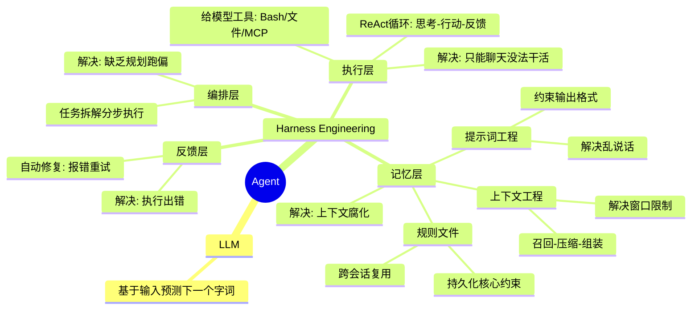

# 学习
## 概念梳理



---

### LLM
大模型本质就是一个磁盘上的超大参数文件。将它加载到显卡内存里，配上HTTP接口就成了大模型API服务。大模型做的事情也很简单，就是基于当前输入的内容预测下一个字词大概率会是什么，它本质上只是在猜你想要什么。

### Prompt Engineering
如果你给LLM的指令太宽泛，那它预测的答案就会非常发散。比如你问它“做个去云南的攻略”，它可能会给你整出一个长达15天、预算上万的豪华包车游。
但如果你补一句：“你现在是一个穷游达人，背景是我只有周末2天时间；预算不能超过1000块，千万别去人挤人的热门景点，请用表格的形式列出我的行程安排”，它给的结果才会更符合要求，为你量身定制一个特种兵式的周末游。能加的内容有很多，比如角色设定、背景、历史对话、参考文档、限制、输出格式，这些约束构成了所谓的提示词。而这种有意识地调整和设计提示词，让模型稳定地朝着你预期的内容和格式输出的技术手段，就是所谓的提示词工程，它解决的是大模型无引导乱说话的问题。

### Context Engineering
提示词写的越长越仔细，模型知道的就越多，回答就越准，反过来同理。大模型回答不准，那大概率是因为知道的不够多，于是大家很自然会不断往大模型里塞各种资料。这些打包到一起发给大模型的所有信息就叫上下文，提示词只是上下文的一部分。
但大模型再强，一次性能处理的上下文也有最大限制，这个限制叫上下文窗口。在AI大模型应用里多对话几轮，就很容易将上下文窗口打满。于是就需要通过一些策略去压缩或丢弃部分信息，在这个过程中不可避免会丢失关键信息，从而破坏上下文的完整性和准确性。这类问题被统称为上下文腐化，效果上就是模型开始记不住，回答前后不一致。
上下文窗口就这么大，于是问题就变成了怎么才能在合适的时候将合适的内容塞入到有限的上下文中，于是衍生了一套负责动态管理大模型上下文的技术，也就是所谓的上下文工程。提示词是上下文的一部分，那自然提示词工程其实也是上下文工程的一部分，上下文工程可以总结为三个步骤：召回、压缩和组装。第一步召回，说白了就是找什么信息，这些信息可以来自外部知识库，也可以来自过去聊天记录、当前代码环境以及程序运行报错等。总之就是从里面找出最相关的内容。信息很多，上下文窗口有限，所以需要将信息变小，于是引入第二步压缩。比如将信息分开发给大模型做总结。之后就是组装，因为信息放置的位置和顺序会直接影响模型的理解和输出，比如越靠后越容易被模型关注，所以我们需要通过一定的结构重新组装内容，这样进入模型的上下文更精简、更相关，输出也会更稳定、更准确。不同AI工具的上下文工程策略不同，所以你会发现就算用的是同一个模型，不同AI工具的执行效果也会有差异

### Harness Engineering

#### 执行层

提示词工程解决了大模型无引导乱说话的问题，上下文工程解决的是上下文的组织问题。模型是更聪明了，但他只能聊天，没法帮我们干活。于是我们可以给大模型加入 Bash 沙箱、文件系统、MCP 这些能力，让它能像人一样操作外部工具，读写代码文件，执行命令做测试。它们共同构成了执行层。
将上下文工程+大模型+执行层串成一个流程，在外部套一层循环，于是我们就可以通过提示词工程和上下文工程组装上下文发给大模型。大模型负责思考，外部程序负责执行，执行过程中得到的报错等信息，再加到上下文里，继续推理和执行。这套一边思考一边行动的循环就是所谓的 ReAct，而这个能通过聊天帮你执行任务的程序，就是所谓的 AI Agent。Agent 的本质就是一个 for 循环。

#### 记忆层
只要这个循环一长，上下文就一定会膨胀，上下文工程做再好也可能会腐化。随着它看过的文件越来越多，拿到的信息越来越杂，前面定好的目标和约束，后面可能慢慢就被冲淡了，理解也会越来越偏，怎么办呢？很简单，只要我们可以保证每次给大模型的上下文中都包含一些可复用的核心信息，比如项目目标、技术栈、需求背景、代码风格、禁止事项等，只要保证这部分一直在，那大模型就能在大框架约束下减少理解偏移。
这些核心信息可以单独写成规则文件，固定在代码仓库里，比如 Claude Code 用 claude.md，Cursor 用 .cursorrules 文件。规则文件会在调用大模型的时候作为系统提示词，自动注入上下文。规则文件写多了也会变长，所以上下文也会很长，那就把它拆成几份更短的文件，再加一个简单的路由。比如背景就读 bg.md，技术栈就看 stack.md，一般情况下只需要加载文件地址路径，真正需要的时候再加载文件的全部内容。将它们跟提示词工程和上下文工程配合在一起，形成记忆层。

#### 反馈层
有了记忆层和执行层的配合，Agent 就能不停写代码，跑 linter 和单元测试。过程中发现执行有问题，还可以将测试输出和报错加入到上下文里，这样就可以驱动 Agent 在下一轮循环中自动做修复。这套通过检验结果回算错误来实现自动修复问题的能力，形成了反馈层。

#### 编排层
但 Agent的循环如果缺乏全局规划和清晰的结束目标，依然很容易跑偏，甚至陷入无效死循环。所以我们还可以将大任务拆解为有明确执行标准的多个子任务，就像这样按规划驱动Agent分步执行。这种以全局规划为核心，对任务做拆解与全流程管控的能力，形成了编排层。

编排层、执行层、反馈层和记忆层这些能力，共同组成了一套包裹着大模型的工程外壳，它就是Harness Engineering。大模型越强，外壳就可以做得越薄，但无论怎么样这层外壳都得有

### Agent
> https://www.langchain.com/blog/the-anatomy-of-an-agent-harness
> Agent = Model + Harness.  Harness engineering is how we build systems around models to turn them into work engines.  The model contains the intelligence and the harness makes that intelligence useful

所以我们可以认为 Agent 就是 LLM + Harness Engineering. 


## claude code 探索

根据 Harness Engineering 的四层架构，探索 Claude Code 的实现：

### 学习路径

四层架构围绕 ReAct 循环构建，学习顺序：**建立循环 → 每轮需要 → 偶尔需要 → 顶层控制**

```
第1步：执行层（建立循环框架）
    问题：模型只能聊天，没法干活
    解决：工具系统 + 权限沙箱 + ReAct循环

    文档：
    docs/tools/what-are-tools.mdx      → 工具抽象设计
    docs/safety/permission-model.mdx   → 权限模型
    docs/safety/sandbox.mdx            → 沙箱机制

    源码：
    src/query.ts                       → ReAct循环主入口
    src/tools.ts                       → 工具注册表
    src/Tool.ts                        → Tool类型定义

第2步：记忆层（每轮循环都需要）
    问题：循环一长，上下文膨胀，约束被冲淡
    解决：提示词工程 + 上下文工程 + 规则文件

    文档：
    docs/context/system-prompt.mdx     → 上下文组装策略
    docs/context/token-budget.mdx      → Token预算管理
    docs/context/compaction.mdx        → 压缩策略
    docs/context/project-memory.mdx    → 跨会话持久化

    源码：
    src/context.ts                     → 上下文组装
    src/utils/claudemd.ts              → CLAUDE.md加载

第3步：反馈层（执行出错时才需要）
    问题：工具执行可能失败，需要自动修复
    解决：错误重试 + 自动修复 + Compaction

    文档：
    docs/conversation/the-loop.mdx     → 循环中的错误处理
    docs/conversation/streaming.mdx    → 流式响应中的错误

    源码：
    src/query.ts                       → 错误重试逻辑
    src/services/compact/              → Compaction服务

第4步：编排层（循环的顶层控制）
    问题：循环缺乏全局规划，容易跑偏或死循环
    解决：任务拆解 + 子Agent + 协调器

    文档：
    docs/agent/sub-agents.mdx          → 子Agent机制
    docs/agent/coordinator-and-swarm.mdx → 协调器与Swarm
    docs/agent/worktree-isolation.mdx  → 工作树隔离

    源码：
    src/tools/AgentTool/               → Agent工具实现
    src/utils/src/tools/AgentTool/     → Agent相关工具

────────────────────────────────────────
扩展学习（理解完整生态）
    docs/introduction/                 → 整体认知
    docs/features/                     → 功能特性
    docs/extensibility/                → MCP协议、自定义Agent
    docs/internals/                    → 内部机制
```

---

## 学习笔记

### 第1步：执行层 ✅

#### 核心架构

```
┌─────────────────────────────────────────────────┐
│  ReAct 循环 (src/query.ts)                       │
│  while(true) { 思考 → 行动 → 反馈 }              │
└─────────────────────────────────────────────────┘
          ↓ AI 说"我要执行命令"
┌─────────────────────────────────────────────────┐
│  工具系统 (src/Tool.ts + src/tools.ts)           │
│  50+ 工具通过 Tool 接口统一管理                   │
└─────────────────────────────────────────────────┘
          ↓ 权限检查
┌─────────────────────────────────────────────────┐
│  权限模型 (Allow/Ask/Deny)                       │
│  五层规则来源 + 三维度匹配                        │
└─────────────────────────────────────────────────┘
          ↓ 允许执行
┌─────────────────────────────────────────────────┐
│  沙箱机制 (OS级隔离)                              │
│  文件系统 + 网络限制                              │
└─────────────────────────────────────────────────┘
```

#### ReAct 循环

**本质**：一个 `while(true)` 无限循环，每次迭代代表一次"思考→行动→观察"

**每次迭代的阶段**：
1. 上下文预处理 → 压缩/优化消息
2. 流式API调用 → AI 思考，返回 tool_use
3. 工具执行 → 真正"干活"
4. 终止或继续 → 有 tool_use 就继续

**终止条件**：
- `completed`：AI 未发出 tool_use
- `aborted`：用户中断
- `max_turns`：轮次超限
- `prompt_too_long`：token 超限且无法压缩

#### 工具系统

**Tool 类型核心四要素**：
| 字段 | 说明 |
|------|------|
| `name` | 唯一标识（如 `Bash`、`Read`） |
| `inputSchema` | Zod schema，定义参数类型 |
| `call()` | 执行函数 |
| `prompt()` | 使用说明，注入 System Prompt |

**调用链路**：
```
tool_use(name, input)
  → validateInput()     // 校验参数
  → canUseTool()        // 权限弹窗（Ask模式）
  → call()              // 执行
  → tool_result         // 返回给 AI
```

**50+ 工具分类**：文件操作、命令执行、对话管理、任务追踪、Web能力、规划与版本

#### 权限模型

**三级权限**：
- `Allow`：自动放行
- `Ask`：弹窗确认
- `Deny`：直接拒绝

**五层规则来源**（优先级高→低）：
```
session > cliArg > command > projectSettings > userSettings > policySettings
```

**三维度匹配**：
- 工具名：`Bash`、`mcp__server1`
- 命令模式：`git *`
- 路径模式：`src/**`

**四种权限模式**：
| 模式 | 行为 |
|------|------|
| Default | 敏感操作逐一确认 |
| Plan | 只读不写 |
| Auto | 自动决策 |
| Bypass | 全部放行 |

#### 沙箱机制

**核心关系**：
```
权限系统 → 决定"能不能执行"
沙箱     → 决定"执行后能做什么"
```

**双层防御（Defense-in-Depth）**：
- 应用层：权限规则匹配
- OS 层：沙箱隔离（文件系统 + 网络）

**平台差异**：
| 平台 | 沙箱实现 |
|------|---------|
| macOS | sandbox-exec |
| Linux/WSL2 | bubblewrap + seccomp |
| Windows | 不支持 |

**默认限制**：
- 文件系统：只能写工作目录 + Claude 临时目录
- 网络：只有白名单域名可访问
- 强制拒绝：settings.json、.claude/skills 等高风险路径

### 第2步：记忆层 ✅

#### 核心架构

```
┌─────────────────────────────────────────────────┐
│  System Prompt 组装 (src/constants/prompts.ts)  │
│  string[] 数组 + 缓存分块策略                     │
└─────────────────────────────────────────────────┘
          ↓
┌─────────────────────────────────────────────────┐
│  静态区 (scope: 'global')                        │
│  Intro、Rules、Tone & Style...                   │
└─────────────────────────────────────────────────┘
          ↓ BOUNDARY 分界
┌─────────────────────────────────────────────────┐
│  动态区 (每次会话不同)                            │
│  Session Guidance、Memory、CLAUDE.md...          │
└─────────────────────────────────────────────────┘
```

#### System Prompt 设计

**为什么是 `string[]` 而非单个 `string`**：
- 缓存分块：不变的部分（静态区）可获得独立缓存命中
- 单个字符串任何字符变化都会导致整个缓存失效

**三阶段管道**：
```
getSystemPrompt()           → string[]        (组装内容)
buildEffectiveSystemPrompt() → SystemPrompt   (选择优先级)
buildSystemPromptBlocks()    → TextBlockParam[] (分块+缓存标记)
```

**静态区 vs 动态区**：
- 静态区：可跨组织缓存 (`scope: 'global'`)，仅 1P 用户可用
- 动态区：每次会话不同，组织级缓存或不缓存
- `BOUNDARY` 标记：分隔静态区与动态区，AI 看不到

#### Token 预算管理

**200K 上下文窗口分配**：
```
200K 总窗口
├── 系统提示词 (~15-25K)
├── 工具定义 (~10-20K)
├── 用户上下文 (CLAUDE.md、git status)
├── 输出预留 (默认 8K，最大 64K)
└── 剩余：对话历史空间
```

**两级 Token 计数**：
- 近似估算（毫秒级）：`content.length / 4`
- 精确计数（API 调用）：`countTokens` 端点

**自动压缩触发阈值**（200K 窗口）：
- ~167K：warning 提示
- ~180K：自动压缩触发（200K - 20K 输出 - 13K buffer）
- ~197K：blocking limit

#### Compaction 三层策略

| 层级 | 触发条件 | 需要 API |
|------|---------|:---:|
| MicroCompact | 单个工具输出过长 | 否 |
| Session Memory | 自动压缩（需 feature flag）| 否 |
| 传统 API 摘要 | 手动 /compact 或回退 | 是 |

**压缩后重新注入**（50K token 预算）：
- 最近 5 个文件内容（每个 5K）
- 已激活技能指令（总计 25K）
- CLAUDE.md 内容

**关键机制**：
- `CompactBoundary`：标记压缩边界，后续只处理 boundary 之后的消息
- 工具对完整性保护：确保 tool_use 和 tool_result 不被拆散

#### 项目记忆系统

**存储架构**：纯文件系统，无数据库
```
~/.claude/projects/<git-root>/memory/
├── MEMORY.md        ← 入口索引（每次对话加载，≤200行/25KB）
├── user_*.md        ← 用户记忆
├── feedback_*.md    ← 反馈记忆
├── project_*.md     ← 项目记忆
└── reference_*.md   ← 参考记忆
```

**四类型分类法**：
| 类型 | 存储内容 | 典型触发 |
|------|---------|---------|
| user | 用户角色、偏好 | "我是数据科学家" |
| feedback | 用户纠正和确认 | "别 mock 数据库" |
| project | 项目上下文 | "合并冻结从周四开始" |
| reference | 外部系统指针 | "pipeline bugs 在 Linear" |

**智能召回**：Sonnet 侧查询筛选 ≤5 条最相关记忆

**关键约束**：只存储无法从当前项目状态推导的信息

### 第3步：反馈层 ✅

#### 核心架构

```
┌─────────────────────────────────────────────────┐
│  流式响应 (src/services/api/claude.ts)           │
│  SSE 事件流 + 停滞检测 + 空闲超时                 │
└─────────────────────────────────────────────────┘
          ↓ 错误检测
┌─────────────────────────────────────────────────┐
│  恢复路径 (src/query.ts)                         │
│  输出截断 → 上下文超限 → Hook阻塞 → 模型降级      │
└─────────────────────────────────────────────────┘
          ↓ 自动修复
┌─────────────────────────────────────────────────┐
│  State 状态机                                    │
│  transition 字段防止恢复路径无限循环              │
└─────────────────────────────────────────────────┘
```

#### 流式响应机制

**事件处理状态机**：
```
message_start
  ├── content_block_start (text/tool_use/thinking)
  │   ├── content_block_delta (增量数据)
  │   └── content_block_stop (yield AssistantMessage)
  └── message_delta (stop_reason + usage)
message_stop
```

**流式错误处理**：
| 场景 | 检测机制 | 处理方式 |
|------|---------|---------|
| 网络断开 | 被动停滞(30s) + 主动超时(90s) | 重试/非流式降级 |
| API 限流 | 429 错误 | 指数退避重试 |
| 输出超限 | `max_tokens` | 升级输出上限重试 |
| 上下文超限 | `model_context_window_exceeded` | 触发 compaction |

#### 五种恢复路径

```
1. next_turn（正常工具循环）
   tool_use → 执行工具 → 结果追加 → continue

2. max_output_tokens（输出截断）
   截断 → 提升上限(64K) → 静默重试 → 恢复消息重试(≤3次)

3. prompt_too_long（上下文超限）
   413错误 → Context Collapse Drain → Reactive Compact

4. stop_hook_blocking（Hook阻塞）
   Stop hook注入阻塞错误 → AI重新思考 → continue

5. token_budget_continuation（预算提示）
   token达阈值 → 注入nudge消息 → AI加速收尾
```

#### 模型降级

```
主模型不可用 → 清空assistantMessages → 移除思维签名
→ 切换fallbackModel → 生成系统消息 → 重新请求
```

**关键设计**：
- `transition` 字段记录恢复原因，防止无限循环
- `hasAttemptedReactiveCompact` 标志防止重复压缩
- `maxOutputTokensRecoveryCount` 限制恢复次数

### 第4步：编排层 ✅

#### 核心架构

```
┌─────────────────────────────────────────────────┐
│  子 Agent 机制 (AgentTool)                       │
│  命名 Agent / Fork子进程 / GP回退                │
└─────────────────────────────────────────────────┘
          ↓ 任务委派
┌─────────────────────────────────────────────────┐
│  协作模式                                        │
│  Coordinator Mode（星型） / Agent Swarms（蜂群）  │
└─────────────────────────────────────────────────┘
          ↓ 隔离机制
┌─────────────────────────────────────────────────┐
│  Worktree 隔离                                   │
│  Git worktree 实现文件级隔离                      │
└─────────────────────────────────────────────────┘
```

#### 子 Agent 三种路径

| 路径 | 触发条件 | 特点 |
|------|---------|------|
| 命名 Agent | `subagent_type` 指定 | 独立工具池、独立权限 |
| Fork 子进程 | Fork 启用 + 类型省略 | 共享 Prompt Cache、继承父工具 |
| GP 回退 | Fork 关闭 + 类型省略 | 通用处理 |

**内置 Agent**：
| Agent | 模型 | 权限 | 用途 |
|-------|------|------|------|
| Explore | Haiku | 只读 | 代码库搜索 |
| Plan | 继承 | 只读 | Plan Mode 研究 |
| General-purpose | 继承 | 全部 | 通用任务 |

**生命周期**：
- 同步 Agent：可后台化（默认 120s）
- 异步 Agent：立即返回 `async_launched`

#### 协作模式对比

| 维度 | Coordinator Mode | Agent Swarms |
|------|-----------------|--------------|
| 拓扑 | 星型（Coordinator 居中） | 星型+P2P 混合 |
| 角色 | Coordinator 编排、Worker 执行 | Team Lead + Teammate 认领 |
| 通信 | SendMessage + task-notification | Mailbox 消息系统 |
| 适用 | 集中决策的复杂任务 | 高并行度独立任务 |

**Coordinator 核心约束**：先理解，再分配

**Agent Teams 核心机制**：
- 共享任务列表 + 竞争认领
- Mailbox 消息系统（message / broadcast）
- Hook 事件：TaskCreated、TaskCompleted、TeammateIdle

#### Worktree 隔离

**解决的问题**：
- 写入冲突：多个 Agent 同时编辑同一文件
- 状态干扰：一个 Agent 的修改破坏另一个的环境
- 不可区分：修改混在一起

**目录结构**：
```
<repo-root>/.claude/worktrees/
├── fix-auth-bug/      # 独立工作目录
│   ├── .git           # 指向主仓库
│   └── src/...
└── add-dark-mode/     # 另一个 worktree
```

**生命周期**：
- 创建：`EnterWorktreeTool` → `git worktree add -b worktree/<slug>`
- 退出：`ExitWorktreeTool` → keep（保留）或 remove（删除）
- 子 Agent：自动清理（有变更保留，无变更删除）

**安全防护**：fail-closed 设计，变更统计失败时拒绝删除

---

## 扩展学习

### MCP 协议

**两种模式**：

| 维度 | 内置 MCP | 外部 MCP |
|------|---------|---------|
| Transport | InProcessTransport（同进程） | stdio/SSE/HTTP/WebSocket |
| 配置来源 | 动态注册 | settings.json/.mcp.json |
| 进程模型 | 零开销 | 子进程或网络连接 |
| 权限 | allowedTools 自动授权 | passthrough 进入权限确认 |

**7种传输层**：stdio、sse、http、sse-ide、ws-ide、ws、claudeai-proxy、InProcess

**核心流程**：
```
配置 → connectToServer（memoize缓存）→ fetchToolsForClient（LRU缓存）
→ 工具名: mcp__<serverName>__<toolName>
```

### 自定义 Agent

**三种来源**（优先级高→低）：
```
User/Project/Policy → Plugin → Built-in
```

**Markdown Agent 格式**：
```markdown
---
name: "reviewer"
description: "Code review specialist"
tools: "Read,Glob,Grep"
model: "haiku"
permissionMode: "plan"
isolation: "worktree"
---
你是代码审查专家...（正文 = system prompt）
```

**工具过滤**：
- `tools`：白名单
- `disallowedTools`：黑名单
- `memory` 启用时自动注入 Write/Edit/Read

### Skills 技能系统

**Tool vs Skill**：
| 维度 | Tool | Skill |
|------|------|-------|
| 粒度 | 单个原子操作 | 完整工作流 |
| 触发 | AI 自主选择 | 用户 `/skill` 或 AI 匹配 |
| 本质 | TypeScript 代码 | Prompt + 权限配置 |

**五个来源**：内置命令、Bundled Skills、磁盘 Skills、MCP Skills、Legacy Commands

**两条执行路径**：
- Inline：Prompt 注入主对话流
- Fork：独立子 Agent 执行

**条件激活**：`paths` 模式匹配时才激活

### Hooks 生命周期钩子

**27 种 Hook 事件**：覆盖会话、工具执行、权限、子 Agent、压缩等

**6 种 Hook 类型**：
| 类型 | 执行方式 |
|------|---------|
| command | Shell 命令 |
| prompt | 注入 AI 上下文 |
| agent | 启动子 Agent |
| http | HTTP 请求 |
| callback | 内部 JS 函数 |
| function | 运行时注册 |

**四种能力**：拦截操作、修改行为、注入上下文、控制流程

**安全机制**：所有 Hook 要求工作区信任

### Feature Flags

**机制**：`feature()` 构建时求值，`false` 分支被 DCE 移除

**88+ 个 Flags 分类**：
| 类别 | 代表性 Flags |
|------|-------------|
| Agent/自动化 | KAIROS、PROACTIVE、COORDINATOR_MODE |
| 基础设施 | DAEMON、BG_SESSIONS、BRIDGE_MODE |
| 安全/分类 | TRANSCRIPT_CLASSIFIER、BASH_CLASSIFIER |
| 工具/能力 | WEB_BROWSER_TOOL、VOICE_MODE |
| UI/体验 | BUDDY、QUICK_SEARCH |
| 平台/实验 | ULTRAPLAN、ULTRATHINK |

---